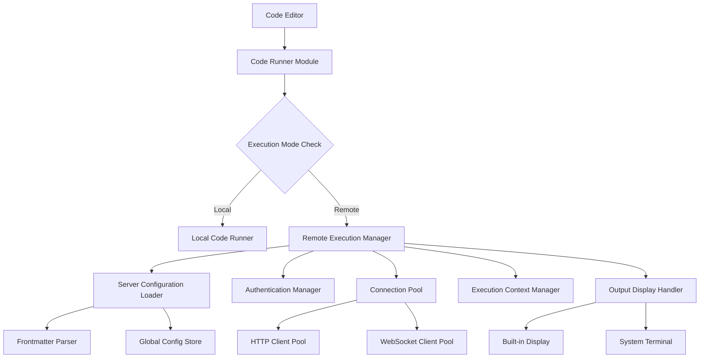

# Design Document: Remote Code Execution

## Overview

This feature enables Velotype to execute code blocks on remote servers instead of locally. The app should remain lightweight (size increase <5MB, memory <100MB, response <500ms) while supporting per-document server configuration via frontmatter, secure authentication storage with auto-reuse, flexible output display options (external terminal or built-in), and session management with configurable context persistence.

## Architecture



### Component Overview

- **Code Runner Module**: Main entry point for code execution, delegates to local or remote runner
- **Server Configuration Loader**: Loads server configuration from frontmatter or global settings
- **Authentication Manager**: Handles secure storage and retrieval of authentication credentials
- **Connection Pool**: Manages connections to remote servers with pooling and reuse
- **Execution Context Manager**: Maintains execution state across multiple code executions
- **Output Display Handler**: Routes output to appropriate display (built-in or external terminal)
- **Frontmatter Parser**: Parses markdown frontmatter for server configuration
- **Global Config Store**: Stores global server configuration preferences

## Components and Interfaces

### Component 1: Code Runner Module

**Purpose**: Main entry point for code execution that delegates to local or remote execution based on configuration

**Interface**:
```pascal
FUNCTION execute_code_block(
  code: String,
  language: String,
  document_path: String,
  work_dir: String
) RETURNS CodeRunResponse
```

**Responsibilities**:
- Load server configuration for the document
- Determine execution mode (local vs remote)
- Handle fallback from remote to local execution
- Coordinate with other execution components

### Component 2: Server Configuration Loader

**Purpose**: Loads and manages server configuration from frontmatter and global settings

**Interface**:
```pascal
FUNCTION load_server_config(document_path: String) RETURNS ServerConfig
```

**Responsibilities**:
- Parse markdown frontmatter for server configuration
- Validate frontmatter structure and required fields
- Fallback to global configuration when frontmatter is missing or invalid
- Log configuration loading errors

### Component 3: Authentication Manager

**Purpose**: Securely stores and manages authentication credentials for remote servers

**Interface**:
```pascal
FUNCTION authenticate_server(config: ServerConfig) RETURNS AuthenticationCredentials
FUNCTION store_credentials_securely(storage_key: String, credentials: AuthenticationCredentials)
FUNCTION load_stored_credentials(storage_key: String) RETURNS Optional<AuthenticationCredentials>
```

**Responsibilities**:
- Retrieve stored credentials from secure storage
- Validate credential expiration and validity
- Prompt user for credentials when not available
- Securely store credentials after initial authentication
- Handle credential rotation and expiration

### Component 4: Connection Pool

**Purpose**: Manages reusable connections to remote servers with pooling and lifecycle control

**Interface**:
```pascal
FUNCTION get_connection(server_config: ServerConfig) RETURNS ConnectionHandle
FUNCTION return_connection(connection: ConnectionHandle)
FUNCTION invalidate_connection(connection: ConnectionHandle)
FUNCTION pool_stats() RETURNS Map<String, Any>
```

**Responsibilities**:
- Maintain idle connections for configured duration
- Reuse connections for multiple executions to the same server
- Reestablish connections when they become stale or invalid
- Limit maximum concurrent connections per server
- Clean up resources for idle connections

### Component 5: Execution Context Manager

**Purpose**: Maintains execution state across multiple code executions within a session

**Interface**:
```pascal
FUNCTION create_session(context_id: String, config: ServerConfig) RETURNS ExecutionSession
FUNCTION maintain_execution_context(session: ExecutionSession, response: CodeRunResponse, strategy: Enum) RETURNS ExecutionSession
FUNCTION reset_session_context(session: ExecutionSession) RETURNS ExecutionSession
FUNCTION get_session_context(session: ExecutionSession) RETURNS Map<String, Any>
```

**Responsibilities**:
- Create and manage execution sessions
- Preserve context data between executions
- Reset context when explicitly requested
- Apply context persistence strategies (session-only, document-open, persistent)
- Isolate contexts between different documents

### Component 6: Output Display Handler

**Purpose**: Routes execution results to appropriate display mechanism

**Interface**:
```pascal
FUNCTION display_output(response: CodeRunResponse, options: DisplayOptions)
FUNCTION switch_display_mode(mode: Enum {BUILTIN, EXTERNAL_TERMINAL})
```

**Responsibilities**:
- Display execution results in built-in panel or external terminal
- Show code snippet, input parameters, output, execution time, and errors
- Truncate large outputs (>10,000 chars) with "view full output" option
- Format output for readability

### Component 7: Frontmatter Parser

**Purpose**: Parses markdown frontmatter to extract server configuration

**Interface**:
```pascal
FUNCTION parse_frontmatter(document: String) RETURNS Map<String, Any>
FUNCTION extract_server_config(frontmatter: Map<String, Any>) RETURNS ServerConfig
```

**Responsibilities**:
- Extract frontmatter section from markdown documents
- Validate frontmatter structure
- Convert frontmatter data to ServerConfig structure
- Handle parsing errors gracefully

### Component 8: Global Config Store

**Purpose**: Stores and manages global server configuration preferences

**Interface**:
```pascal
FUNCTION load_global_server_config() RETURNS ServerConfig
FUNCTION save_global_server_config(config: ServerConfig)
FUNCTION delete_global_server_config()
FUNCTION load_all_configs() RETURNS List<ServerConfig>
```

**Responsibilities**:
- Persist global server configuration to storage
- Load configuration on application startup
- Support concurrent access from multiple documents
- Handle configuration deletion

## Data Models

### Model 1: CodeRunRequest

Represents a code execution request to be sent to a remote server

```pascal
STRUCTURE CodeRunRequest
  code: String
  language: String
  server_config: Optional<ServerConfig>
  context_id: Optional<String>
  request_id: UUID
END STRUCTURE
```

**Validation Rules**:
- `code` must be a non-empty string
- `language` must be a valid programming language identifier
- `code` length must not exceed 100KB
- `request_id` must be a valid UUID

### Model 2: CodeRunResponse

Represents the response from a code execution

```pascal
STRUCTURE CodeRunResponse
  request_id: UUID
  output: String
  error: Optional<String>
  exit_code: Optional<i32>
  duration_ms: u64
  context_id: Optional<String>
END STRUCTURE
```

**Validation Rules**:
- `request_id` must match the original request
- If `error` is present, `exit_code` should indicate failure (non-zero or null)
- `duration_ms` must be non-negative
- `output` and `error` should not both contain substantial content

### Model 3: ServerConfig

Server configuration for remote code execution

```pascal
STRUCTURE ServerConfig
  hostname: String
  port: u16
  protocol: Enum {HTTP, HTTPS, WS, WSS}
  auth_method: Enum {API_KEY, BEARER_TOKEN, SSH_KEY, NONE}
  auth_storage_key: String
  timeout_ms: u64
  fallback_to_local: Boolean
END STRUCTURE
```

**Validation Rules**:
- `hostname` must be a non-empty string or valid IP address
- `port` must be between 1 and 65535
- `protocol` must be one of the supported protocols
- `auth_method` must be one of the supported authentication methods
- `timeout_ms` must be at least 1000ms (1 second)

### Model 4: ExecutionSession

Represents an execution session with context persistence

```pascal
STRUCTURE ExecutionSession
  session_id: UUID
  context_id: String
  context_data: Map<String, Any>
  created_at: DateTime
  last_activity: DateTime
  config: ServerConfig
END STRUCTURE
```

**Validation Rules**:
- `session_id` must be a valid UUID
- `context_id` must be unique across documents
- `context_data` should not exceed 10MB
- `last_activity` must be >= `created_at`

### Model 5: AuthenticationCredentials

Authentication credentials for server access

```pascal
STRUCTURE AuthenticationCredentials
  storage_key: String
  method: Enum {API_KEY, BEARER_TOKEN, SSH_KEY}
  api_key: Optional<String>
  bearer_token: Optional<String>
  ssh_private_key: Optional<String>
  ssh_passphrase: Optional<String>
  expires_at: Optional<DateTime>
END STRUCTURE
```

**Validation Rules**:
- `method` must be one of the supported authentication methods
- Required fields based on `method`:
  - `API_KEY`: `api_key` must be present
  - `BEARER_TOKEN`: `bearer_token` must be present
  - `SSH_KEY`: `ssh_private_key` must be present
- `expires_at` must be in the future if present
- Credentials must be encrypted in storage

### Model 6: ConfiguredServer

Combined server configuration with credentials and connection

```pascal
STRUCTURE ConfiguredServer
  server: ServerConfig
  credentials: Optional<AuthenticationCredentials>
  connection: Optional<ConnectionHandle>
END STRUCTURE
```

**Validation Rules**:
- `server` must be a valid ServerConfig
- If `credentials` is present, authentication method must match server config
- Connection handle must be valid if present

## Core Interfaces/Types

```pascal
STRUCTURE CodeRunRequest
  code: String
  language: String
  server_config: Optional<ServerConfig>
  context_id: Optional<String>
  request_id: UUID
END STRUCTURE

STRUCTURE CodeRunResponse
  request_id: UUID
  output: String
  error: Optional<String>
  exit_code: Optional<i32>
  duration_ms: u64
  context_id: Optional<String>
END STRUCTURE

STRUCTURE ServerConfig
  hostname: String
  port: u16
  protocol: Enum {HTTP, HTTPS, WS, WSS}
  auth_method: Enum {API_KEY, BEARER_TOKEN, SSH_KEY, NONE}
  auth_storage_key: String
  timeout_ms: u64
  fallback_to_local: Boolean
END STRUCTURE

STRUCTURE ExecutionSession
  session_id: UUID
  context_id: String
  context_data: Map<String, Any>
  created_at: DateTime
  last_activity: DateTime
  config: ServerConfig
END STRUCTURE

STRUCTURE AuthenticationCredentials
  storage_key: String
  method: Enum {API_KEY, BEARER_TOKEN, SSH_KEY}
  api_key: Optional<String>
  bearer_token: Optional<String>
  ssh_private_key: Optional<String>
  ssh_passphrase: Optional<String>
  expires_at: Optional<DateTime>
END STRUCTURE

STRUCTURE ConfiguredServer
  server: ServerConfig
  credentials: Optional<AuthenticationCredentials>
  connection: Optional<ConnectionHandle>
END STRUCTURE
```

## Key Functions with Formal Specifications

### Function: execute_code_block()

```pascal
FUNCTION execute_code_block(
  code: String,
  language: String,
  document_path: String,
  work_dir: String
) RETURNS CodeRunResponse
```

**Preconditions:**
- `code` is a non-empty string
- `language` is a valid programming language identifier
- `document_path` is a valid file path
- `work_dir` is a valid directory path

**Postconditions:**
- If remote execution is configured: Returns response from remote server
- If no remote configuration or remote fails: Returns response from local execution
- Response includes output, error (if any), exit code, and duration
- All execution state is properly cleaned up

**Loop Invariants:** N/A

### Function: load_server_config()

```pascal
FUNCTION load_server_config(document_path: String) RETURNS ServerConfig
```

**Preconditions:**
- `document_path` points to a valid markdown file

**Postconditions:**
- If frontmatter contains valid server config: Returns frontmatter config
- If frontmatter is invalid or missing: Returns global default config
- On frontmatter parse error: Logs error and returns global default config

**Loop Invariants:** N/A

### Function: authenticate_server()

```pascal
FUNCTION authenticate_server(config: ServerConfig) RETURNS AuthenticationCredentials
```

**Preconditions:**
- `config.auth_method` is a supported authentication method
- `config.auth_storage_key` is a valid storage identifier

**Postconditions:**
- If credentials exist in secure storage and are valid: Returns stored credentials
- If credentials not found or invalid: Returns empty credentials (user prompt handled elsewhere)
- Credentials are securely stored after initial authentication

**Loop Invariants:** N/A

### Function: execute_on_remote_server()

```pascal
FUNCTION execute_on_remote_server(
  request: CodeRunRequest,
  configured_server: ConfiguredServer
) RETURNS CodeRunResponse
```

**Preconditions:**
- `configured_server` has valid connection handle
- `request.code` is under size limit (default 100KB)
- `request.language` is supported by remote server

**Postconditions:**
- If execution succeeds: Returns response with output and exit code
- If execution fails: Returns response with error message
- If connection fails: Returns error and triggers fallback to local execution
- Response includes execution duration and context ID for persistence

**Loop Invariants:** N/A

### Function: maintain_execution_context()

```pascal
FUNCTION maintain_execution_context(
  session: ExecutionSession,
  response: CodeRunResponse,
  persist_strategy: Enum {SESSION_ONLY, DOCUMENT_OPEN, PERSISTENT}
) RETURNS ExecutionSession
```

**Preconditions:**
- `session` has valid context data
- `response` contains execution results

**Postconditions:**
- If context should persist: Updates session context with new state
- If context should reset: Clears context data
- Session last activity timestamp is updated
- Persistence strategy determines storage location

**Loop Invariants:** N/A

## Algorithmic Pseudocode

### Main Execution Algorithm

```pascal
ALGORITHM execute_code_block
INPUT: code (String), language (String), document_path (String), work_dir (String)
OUTPUT: response (CodeRunResponse)

BEGIN
  // Step 1: Load server configuration for document
  server_config ← load_server_config(document_path)
  
  // Step 2: Check if remote execution is enabled
  IF server_config.fallback_to_local = false THEN
    // Step 3: Load or authenticate with server
    credentials ← authenticate_server(server_config)
    
    // Step 4: Check code size before sending
    IF length(code) > 100KB THEN
      DISPLAY_WARNING("Code block exceeds 100KB limit")
      RETURN local_execution(code, language, work_dir)
    END IF
    
    // Step 5: Execute on remote server
    request ← create_request(code, language, server_config)
    response ← execute_on_remote_server(request, credentials)
    
    // Step 6: Handle failures with fallback
    IF response.error IS NOT NULL AND server_config.fallback_to_local = true THEN
      DISPLAY_WARNING("Remote execution failed, falling back to local")
      RETURN local_execution(code, language, work_dir)
    END IF
    
    RETURN response
  ELSE
    // Step 7: Execute locally when remote is disabled
    RETURN local_execution(code, language, work_dir)
  END IF
END
```

**Preconditions:**
- All input parameters are valid and non-null
- Code size is reasonable for transport

**Postconditions:**
- Response contains either remote or local execution results
- Appropriate warnings are displayed for failures or size limits
- User experience is not degraded by remote execution failures

**Loop Invariants:** N/A

### Server Configuration Loading Algorithm

```pascal
ALGORITHM load_server_config
INPUT: document_path (String)
OUTPUT: server_config (ServerConfig)

BEGIN
  // Step 1: Read document file
  document ← read_file(document_path)
  
  // Step 2: Parse frontmatter
  frontmatter ← parse_frontmatter(document)
  
  // Step 3: Validate frontmatter structure
  IF frontmatter IS VALID AND contains("remote_server") THEN
    config ← extract_server_config(frontmatter)
    
    // Step 4: Validate required fields
    IF config.hostname IS NOT EMPTY AND
       config.port > 0 AND
       config.protocol IS VALID THEN
      RETURN config
    END IF
  END IF
  
  // Step 5: Fallback to global configuration
  global_config ← load_global_server_config()
  RETURN global_config
END
```

**Preconditions:**
- `document_path` points to an existing file

**Postconditions:**
- Returns valid ServerConfig (from frontmatter or global)
- Any frontmatter parsing errors are logged
- Global config is always available as fallback

**Loop Invariants:** N/A

### Authentication Management Algorithm

```pascal
ALGORITHM authenticate_server
INPUT: server_config (ServerConfig)
OUTPUT: credentials (AuthenticationCredentials)

BEGIN
  // Step 1: Check for stored credentials
  stored ← load_stored_credentials(server_config.auth_storage_key)
  
  // Step 2: Validate stored credentials
  IF stored IS NOT NULL AND
     stored.method = server_config.auth_method AND
     stored.expires_at IS NULL OR stored.expires_at > NOW() THEN
    RETURN stored
  END IF
  
  // Step 3: Prompt user for credentials if not found
  user_credentials ← prompt_for_credentials(server_config.auth_method)
  
  // Step 4: Validate user credentials
  IF user_credentials IS NOT NULL THEN
    // Step 5: Store credentials securely
    store_credentials_securely(server_config.auth_storage_key, user_credentials)
    RETURN user_credentials
  ELSE
    RETURN empty_credentials()
  END IF
END
```

**Preconditions:**
- `server_config` has valid authentication method

**Postconditions:**
- Returns valid credentials if authentication succeeds
- Returns empty credentials if authentication fails
- Credentials are securely stored for future use

**Loop Invariants:** N/A

### Context Persistence Algorithm

```pascal
ALGORITHM maintain_execution_context
INPUT: session (ExecutionSession), response (CodeRunResponse), persist_strategy (Enum)
OUTPUT: updated_session (ExecutionSession)

BEGIN
  // Step 1: Check for explicit context reset
  IF response.output CONTAINS "__VELOTYPE_RESET_CONTEXT__" THEN
    RETURN reset_session_context(session)
  END IF
  
  // Step 2: Update session based on strategy
  SWITCH persist_strategy DO
    CASE SESSION_ONLY:
      // Update in-memory context
      session.context_data ← update_context(session.context_data, response.output)
      session.last_activity ← NOW()
      RETURN session
      
    CASE DOCUMENT_OPEN:
      // Persist to document-specific file
      file_path ← get_document_context_path(session.config, session.context_id)
      save_context_to_file(file_path, session.context_data)
      RETURN session
      
    CASE PERSISTENT:
      // Persist to global store with expiration
      save_context_to_global_store(session.context_id, session.context_data, TTL=7days)
      session.last_activity ← NOW()
      RETURN session
  END SWITCH
END
```

**Preconditions:**
- `session` has valid context data
- `response` contains execution results
- `persist_strategy` is a valid persistence option

**Postconditions:**
- Session context is updated according to strategy
- Session activity timestamp is refreshed
- Context data is persisted appropriately

**Loop Invariants:** N/A

## Example Usage

```pascal
// Example 1: Basic code execution
SEQUENCE
  code ← "print('Hello, World!')"
  language ← "python"
  response ← execute_code_block(code, language, "/path/to/doc.md", "/path/to/workdir")
  
  DISPLAY(response.output)
  IF response.exit_code ≠ 0 THEN
    DISPLAY_ERROR("Exit code: " + response.exit_code)
  END IF
END SEQUENCE

// Example 2: With remote configuration
SEQUENCE
  // Document frontmatter
  frontmatter = """
  ---
  remote_server:
    hostname: "code-server.example.com"
    port: 443
    protocol: HTTPS
    auth_method: API_KEY
    auth_storage_key: "codeserver_apikey"
    timeout_ms: 30000
    fallback_to_local: true
  ---
  """
  
  // Execute code with remote config
  code ← "import numpy as np; print(np.arange(10))"
  language ← "python"
  response ← execute_code_block(code, language, "/path/to/doc.md", "/path/to/workdir")
  
  DISPLAY(response.output)
  DISPLAY("Duration: " + response.duration_ms + "ms")
END SEQUENCE

// Example 3: Context persistence
SEQUENCE
  // First execution - establish context
  code1 ← "x = 10"
  session1 ← create_session("python_context_1")
  response1 ← execute_with_context(code1, session1)
  
  // Second execution - use context
  code2 ← "y = x * 2"
  response2 ← execute_with_context(code2, session1)
  
  DISPLAY("x = 10, y = " + response2.output)  // Should output "y = 20"
END SEQUENCE
```

## Correctness Properties

*A property is a characteristic or behavior that should hold true across all valid executions of a system-essentially, a formal statement about what the system should do. Properties serve as the bridge between human-readable specifications and machine-verifiable correctness guarantees.*


### Property 1: Remote execution when configured

*For any* code block, document with valid remote server configuration, and execution request, if remote execution is enabled and the server is available, the system shall send the code to the remote server and return the server's response.

**Validates: Requirements 1.1**

### Property 2: Fallback to local execution on failure

*For any* code block and server configuration, if the remote server is unavailable or returns an error, the system shall fall back to local execution and return the local execution results.

**Validates: Requirements 1.1, 1.4**

### Property 3: Status tracking during execution

*For any* remote execution in progress, the system shall display appropriate execution status and progress information to the user.

**Validates: Requirements 1.2**

### Property 4: Output display on completion

*For any* completed code execution (remote or local), the system shall display the output, exit code, and execution time in the editor.

**Validates: Requirements 1.3**

### Property 5: Error message on server unavailability

*For any* remote execution where the server is unreachable, the system shall display a clear error message indicating the failure and offering fallback options.

**Validates: Requirements 1.4**

### Property 6: Local execution as default

*For any* code block execution where no remote server is configured, the system shall execute the code locally.

**Validates: Requirements 1.5**

### Property 7: Size constraint compliance

*For any* addition of remote execution capabilities, the total app size increase shall be less than 5MB.

**Validates: Requirements 2.1**

### Property 8: Memory usage constraint

*For any* remote code execution, the additional memory usage shall be less than 100MB.

**Validates: Requirements 2.2**

### Property 9: Response time constraint

*For any* code block under 10KB, the request to send code for execution shall complete within 500ms.

**Validates: Requirements 2.3**

### Property 10: Large code block warning

*For any* code block exceeding 100KB, the system shall warn the user before sending to the remote server.

**Validates: Requirements 2.4**

### Property 11: Per-document configuration priority

*For any* markdown document with valid frontmatter server configuration, the system shall use that configuration instead of the global default.

**Validates: Requirements 3.1**

### Property 12: Global configuration fallback

*For any* markdown document without server configuration in frontmatter, the system shall use the global server configuration.

**Validates: Requirements 3.2**

### Property 13: Invalid frontmatter fallback

*For any* markdown document with invalid frontmatter server configuration, the system shall use the global default configuration and notify the user.

**Validates: Requirements 3.3**

### Property 14: Secure credential storage

*For any* user-provided authentication credentials, the system shall store them securely and not expose them in logs or error messages.

**Validates: Requirements 4.1**

### Property 15: Automatic credential reuse

*For any* code execution against a configured server with stored credentials, the system shall automatically include the stored authentication without requiring user input.

**Validates: Requirements 4.2**

### Property 16: Credential expiration handling

*For any* stored credentials that expire or become invalid, the system shall prompt the user to re-authenticate before retrying.

**Validates: Requirements 4.3**

### Property 17: Authentication retry limit

*For any* failed authentication attempt, the system shall retry up to 3 times before showing a permanent error.

**Validates: Requirements 4.4**

### Property 18: External terminal output option

*For any* user who prefers external terminal display, the system shall provide an option to send execution results to an external terminal.

**Validates: Requirements 5.1**

### Property 19: Built-in display option

*For any* user who prefers built-in display, the system shall display execution results in a split-pane or overlay within the editor.

**Validates: Requirements 5.2**

### Property 20: Complete output display

*For any* execution output display, the system shall show the code snippet, input parameters, output results, execution time, and any error messages.

**Validates: Requirements 5.3**

### Property 21: Large output truncation

*For any* execution output exceeding 10,000 characters, the system shall truncate the output and provide a "view full output" option.

**Validates: Requirements 5.4**

### Property 22: Context persistence across executions

*For any* sequence of code blocks executed within the same session, the system shall maintain execution context (variables, loaded modules) between executions.

**Validates: Requirements 6.1**

### Property 23: Explicit context reset

*For any* code block that explicitly requests context reset, the system shall clear all stored state before subsequent executions.

**Validates: Requirements 6.2**

### Property 24: Context preservation after failure

*For any* failed execution, the system shall preserve context for subsequent executions unless explicitly reset.

**Validates: Requirements 6.3**

### Property 25: Configurable persistence duration

*For any* execution session, the context persistence duration shall respect the user's configured strategy (session-only, document-open, or persistent).

**Validates: Requirements 6.4**

### Property 26: Configuration persistence

*For any* server configuration, the system shall persist it to storage and load it on application restart.

**Validates: Requirements 7.1, 7.2**

### Property 27: Configuration deletion

*For any* configuration that has been deleted, the system shall remove it from persistent storage.

**Validates: Requirements 7.3**

### Property 28: Concurrent configuration access

*For any* configuration storage, the system shall support concurrent access from multiple documents.

**Validates: Requirements 7.4**

### Property 29: Connection reuse

*For any* multiple code executions targeting the same server, the system shall reuse existing connections from the pool.

**Validates: Requirements 8.1**

### Property 30: Connection reconnection

*For any* stale or invalid connection, the system shall establish a new connection.

**Validates: Requirements 8.2**

### Property 31: Idle connection maintenance

*For any* idle period without executions, the system shall maintain idle connections for the configured duration.

**Validates: Requirements 8.3**

### Property 32: Connection pool limit

*For any* connection pool, the system shall limit the maximum number of concurrent connections per server.

**Validates: Requirements 8.4**

### Property 33: Context isolation between documents

*For any* code blocks executed from different documents, the system shall maintain separate execution contexts.

**Validates: Requirements 9.1**

### Property 34: Custom context ID usage

*For any* document with a custom context ID, the system shall use that ID for context isolation.

**Validates: Requirements 9.2**

### Property 35: Default context ID derivation

*For any* document without a custom context ID, the system shall derive the context ID from the document path.

**Validates: Requirements 9.3**

### Property 36: Cross-document context isolation

*For any* execution context, data from one document shall not be accessible to another document.

**Validates: Requirements 9.4**

### Property 37: Timeout application

*For any* code execution, the system shall apply the configured timeout from the server configuration.

**Validates: Requirements 10.1**

### Property 38: Default timeout usage

*For any* code execution without a specified timeout, the system shall use a default timeout of 30 seconds.

**Validates: Requirements 10.2**

### Property 39: Timeout enforcement

*For any* execution that exceeds the configured timeout, the system shall cancel the execution and return a timeout error.

**Validates: Requirements 10.3**

### Property 40: Configurable timeout

*For any* execution session, the timeout shall be configurable per-server and per-document.

**Validates: Requirements 10.4**

### Property 41: Credential encryption on storage

*For any* credentials being stored, the system shall encrypt them before persistent storage.

**Validates: Requirements 11.1**

### Property 42: Credential decryption in memory

*For any* credentials being retrieved, the system shall decrypt them only in memory.

**Validates: Requirements 11.2**

### Property 43: Credential secrecy

*For any* execution, the application shall not log or display credentials in any form.

**Validates: Requirements 11.3**

### Property 44: Credential isolation

*For any* stored credentials, they shall be isolated by storage key and not accessible across different server configurations.

**Validates: Requirements 11.4**

### Property 45: Error catching

*For any* remote execution failure, the system shall catch the error and display a user-friendly message.

**Validates: Requirements 12.1**

### Property 46: Connection pool retry

*For any* connection pool error, the system shall retry the operation before failing.

**Validates: Requirements 12.2**

### Property 47: Resource cleanup on error

*For any* unrecoverable error, the system shall clean up resources and return to idle state.

**Validates: Requirements 12.3**

### Property 48: Error context

*For any* error, the system shall include context information (document path, code language, server configuration).

**Validates: Requirements 12.4**