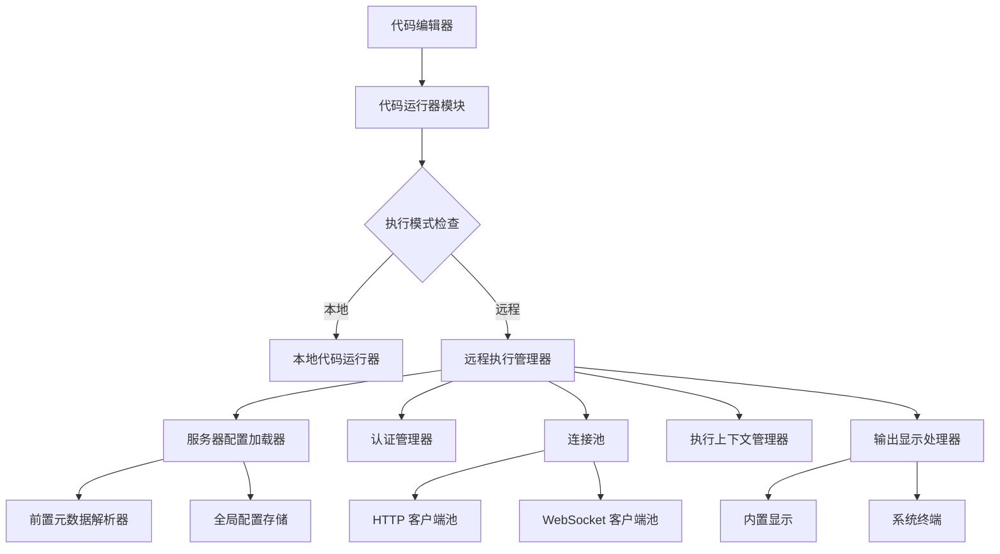

# 设计文档: 远程代码执行

## 概述

此功能使 Velotype 能够在远程服务器上执行代码块,而不是在本地执行。应用程序应保持轻量级(大小增加 <5MB、内存 <100MB、响应 <500ms),同时支持通过前置元数据进行每文档服务器配置、安全认证凭据的自动重用、灵活的输出显示选项(外部终端或内置)、以及带可配置上下文持久化的会话管理。

## 架构



### 组件概述

- **代码运行器模块**: 代码执行的主入口点,根据配置委派给本地或远程运行器
- **服务器配置加载器**: 从前置元数据或全局设置加载服务器配置
- **认证管理器**: 处理认证凭据的安全存储和检索
- **连接池**: 管理到远程服务器的连接,支持池化和重用
- **执行上下文管理器**: 在多次代码执行之间维护执行状态
- **输出显示处理器**: 将输出路由到适当的显示(内置或外部终端)
- **前置元数据解析器**: 解析 Markdown 前置元数据以获取服务器配置
- **全局配置存储**: 存储全局服务器配置首选项

## 组件和接口

### 组件 1: 代码运行器模块

**目的**: 代码执行的主入口点,根据配置委派给本地或远程执行

**接口**:
```pascal
FUNCTION execute_code_block(
  code: String,
  language: String,
  document_path: String,
  work_dir: String
) RETURNS CodeRunResponse
```

**职责**:
- 为文档加载服务器配置
- 确定执行模式(本地 vs 远程)
- 处理从远程到本地执行的回退
- 与其他执行组件协调

### 组件 2: 服务器配置加载器

**目的**: 从前置元数据和全局设置加载和管理服务器配置

**接口**:
```pascal
FUNCTION load_server_config(document_path: String) RETURNS ServerConfig
```

**职责**:
- 解析 Markdown 前置元数据以获取服务器配置
- 验证前置元数据结构和必需字段
- 当前置元数据缺失或无效时回退到全局配置
- 记录配置加载错误

### 组件 3: 认证管理器

**目的**: 为远程服务器安全地存储和管理认证凭据

**接口**:
```pascal
FUNCTION authenticate_server(config: ServerConfig) RETURNS AuthenticationCredentials
FUNCTION store_credentials_securely(storage_key: String, credentials: AuthenticationCredentials)
FUNCTION load_stored_credentials(storage_key: String) RETURNS Optional<AuthenticationCredentials>
```

**职责**:
- 从安全存储检索存储的凭据
- 验证凭据过期和有效性
- 在不可用时提示用户输入凭据
- 初始认证后安全地存储凭据
- 处理凭据轮换和过期

### 组件 4: 连接池

**目的**: 管理到远程服务器的可重用连接,支持池化和生命周期控制

**接口**:
```pascal
FUNCTION get_connection(server_config: ServerConfig) RETURNS ConnectionHandle
FUNCTION return_connection(connection: ConnectionHandle)
FUNCTION invalidate_connection(connection: ConnectionHandle)
FUNCTION pool_stats() RETURNS Map<String, Any>
```

**职责**:
- 为配置的持续时间维护空闲连接
- 重用连接以对同一服务器进行多次执行
- 在连接变旧或无效时重新建立连接
- 限制每个服务器的最大并发连接数
- 清理空闲连接的资源

### 组件 5: 执行上下文管理器

**目的**: 在会话内多次代码执行之间维护执行状态

**接口**:
```pascal
FUNCTION create_session(context_id: String, config: ServerConfig) RETURNS ExecutionSession
FUNCTION maintain_execution_context(session: ExecutionSession, response: CodeRunResponse, strategy: Enum) RETURNS ExecutionSession
FUNCTION reset_session_context(session: ExecutionSession) RETURNS ExecutionSession
FUNCTION get_session_context(session: ExecutionSession) RETURNS Map<String, Any>
```

**职责**:
- 创建和管理执行会话
- 在执行之间保留上下文数据
- 在显式请求时重置上下文
- 应用上下文持久化策略(仅会话、文档打开、持久化)
- 在不同文档之间隔离上下文

### 组件 6: 输出显示处理器

**目的**: 将执行结果路由到适当的显示机制

**接口**:
```pascal
FUNCTION display_output(response: CodeRunResponse, options: DisplayOptions)
FUNCTION switch_display_mode(mode: Enum {BUILTIN, EXTERNAL_TERMINAL})
```

**职责**:
- 在内置面板或外部终端显示执行结果
- 显示代码片段、输入参数、输出、执行时间和错误
- 对大型输出(>10,000 个字符)进行截断并提供"查看完整输出"选项
- 格式化输出以提高可读性

### 组件 7: 前置元数据解析器

**目的**: 解析 Markdown 前置元数据以提取服务器配置

**接口**:
```pascal
FUNCTION parse_frontmatter(document: String) RETURNS Map<String, Any>
FUNCTION extract_server_config(frontmatter: Map<String, Any>) RETURNS ServerConfig
```

**职责**:
- 从 Markdown 文档提取前置元数据部分
- 验证前置元数据结构
- 将前置元数据数据转换为 ServerConfig 结构
- 优雅地处理解析错误

### 组件 8: 全局配置存储

**目的**: 存储和管理全局服务器配置首选项

**接口**:
```pascal
FUNCTION load_global_server_config() RETURNS ServerConfig
FUNCTION save_global_server_config(config: ServerConfig)
FUNCTION delete_global_server_config()
FUNCTION load_all_configs() RETURNS List<ServerConfig>
```

**职责**:
- 将全局服务器配置持久化到存储
- 在应用程序启动时加载配置
- 支持来自多个文档的并发访问
- 处理配置删除

## 数据模型

### 模型 1: CodeRunRequest

表示要发送到远程服务器的代码执行请求

```pascal
STRUCTURE CodeRunRequest
  code: String
  language: String
  server_config: Optional<ServerConfig>
  context_id: Optional<String>
  request_id: UUID
END STRUCTURE
```

**验证规则**:
- `code` 必须是非空字符串
- `language` 必须是有效的编程语言标识符
- `code` 长度不得超过 100KB
- `request_id` 必须是有效的 UUID

### 模型 2: CodeRunResponse

表示代码执行的响应

```pascal
STRUCTURE CodeRunResponse
  request_id: UUID
  output: String
  error: Optional<String>
  exit_code: Optional<i32>
  duration_ms: u64
  context_id: Optional<String>
END STRUCTURE
```

**验证规则**:
- `request_id` 必须匹配原始请求
- 如果存在 `error`,则 `exit_code` 应指示失败(非零或 null)
- `duration_ms` 必须为非负
- `output` 和 `error` 不应同时包含大量内容

### 模型 3: ServerConfig

远程代码执行的服务器配置

```pascal
STRUCTURE ServerConfig
  hostname: String
  port: u16
  protocol: Enum {HTTP, HTTPS, WS, WSS}
  auth_method: Enum {API_KEY, BEARER_TOKEN, SSH_KEY, NONE}
  auth_storage_key: String
  timeout_ms: u64
  fallback_to_local: Boolean
END STRUCTURE
```

**验证规则**:
- `hostname` 必须是非空字符串或有效 IP 地址
- `port` 必须在 1 到 65535 之间
- `protocol` 必须是受支持的协议之一
- `auth_method` 必须是受支持的认证方法之一
- `timeout_ms` 必须至少为 1000ms(1 秒)

### 模型 4: ExecutionSession

表示带上下文持久化的执行会话

```pascal
STRUCTURE ExecutionSession
  session_id: UUID
  context_id: String
  context_data: Map<String, Any>
  created_at: DateTime
  last_activity: DateTime
  config: ServerConfig
END STRUCTURE
```

**验证规则**:
- `session_id` 必须是有效的 UUID
- `context_id` 在文档之间必须唯一
- `context_data` 不应超过 10MB
- `last_activity` 必须 >= `created_at`

### 模型 5: AuthenticationCredentials

服务器访问的认证凭据

```pascal
STRUCTURE AuthenticationCredentials
  storage_key: String
  method: Enum {API_KEY, BEARER_TOKEN, SSH_KEY}
  api_key: Optional<String>
  bearer_token: Optional<String>
  ssh_private_key: Optional<String>
  ssh_passphrase: Optional<String>
  expires_at: Optional<DateTime>
END STRUCTURE
```

**验证规则**:
- `method` 必须是受支持的认证方法之一
- 根据 `method` 的必需字段:
  - `API_KEY`: 必须存在 `api_key`
  - `BEARER_TOKEN`: 必须存在 `bearer_token`
  - `SSH_KEY`: 必须存在 `ssh_private_key`
- 如果存在,则 `expires_at` 必须在未来
- 凭据在存储中必须加密

### 模型 6: ConfiguredServer

结合服务器配置、凭据和连接

```pascal
STRUCTURE ConfiguredServer
  server: ServerConfig
  credentials: Optional<AuthenticationCredentials>
  connection: Optional<ConnectionHandle>
END STRUCTURE
```

**验证规则**:
- `server` 必须是有效的 ServerConfig
- 如果存在 `credentials`,则认证方法必须匹配服务器配置
- 如果存在,则连接句柄必须有效

## 核心接口/类型

```pascal
STRUCTURE CodeRunRequest
  code: String
  language: String
  server_config: Optional<ServerConfig>
  context_id: Optional<String>
  request_id: UUID
END STRUCTURE

STRUCTURE CodeRunResponse
  request_id: UUID
  output: String
  error: Optional<String>
  exit_code: Optional<i32>
  duration_ms: u64
  context_id: Optional<String>
END STRUCTURE

STRUCTURE ServerConfig
  hostname: String
  port: u16
  protocol: Enum {HTTP, HTTPS, WS, WSS}
  auth_method: Enum {API_KEY, BEARER_TOKEN, SSH_KEY, NONE}
  auth_storage_key: String
  timeout_ms: u64
  fallback_to_local: Boolean
END STRUCTURE

STRUCTURE ExecutionSession
  session_id: UUID
  context_id: String
  context_data: Map<String, Any>
  created_at: DateTime
  last_activity: DateTime
  config: ServerConfig
END STRUCTURE

STRUCTURE AuthenticationCredentials
  storage_key: String
  method: Enum {API_KEY, BEARER_TOKEN, SSH_KEY}
  api_key: Optional<String>
  bearer_token: Optional<String>
  ssh_private_key: Optional<String>
  ssh_passphrase: Optional<String>
  expires_at: Optional<DateTime>
END STRUCTURE

STRUCTURE ConfiguredServer
  server: ServerConfig
  credentials: Optional<AuthenticationCredentials>
  connection: Optional<ConnectionHandle>
END STRUCTURE
```

## 具有形式化规范的关键函数

### 函数: execute_code_block()

```pascal
FUNCTION execute_code_block(
  code: String,
  language: String,
  document_path: String,
  work_dir: String
) RETURNS CodeRunResponse
```

**先决条件**:
- `code` 是非空字符串
- `language` 是有效的编程语言标识符
- `document_path` 是有效文件路径
- `work_dir` 是有效目录路径

**后置条件**:
- 如果配置了远程执行:返回来自远程服务器的响应
- 如果没有远程配置或远程失败:返回来自本地执行的响应
- 响应包括输出、错误(如果有)、退出码和持续时间
- 所有执行状态都已正确清理

**循环不变量**: N/A

### 函数: load_server_config()

```pascal
FUNCTION load_server_config(document_path: String) RETURNS ServerConfig
```

**先决条件**:
- `document_path` 指向有效的 Markdown 文件

**后置条件**:
- 如果前置元数据包含有效的服务器配置:返回前置元数据配置
- 如果前置元数据无效或缺失:返回全局默认配置
- 前置元数据解析错误时:记录错误并返回全局默认配置

**循环不变量**: N/A

### 函数: authenticate_server()

```pascal
FUNCTION authenticate_server(config: ServerConfig) RETURNS AuthenticationCredentials
```

**先决条件**:
- `config.auth_method` 是受支持的认证方法
- `config.auth_storage_key` 是有效的存储标识符

**后置条件**:
- 如果凭据存在于安全存储中且有效:返回存储的凭据
- 如果未找到或凭据无效:返回空凭据(用户提示在其他地方处理)
- 初始认证后凭据安全存储

**循环不变量**: N/A

### 函数: execute_on_remote_server()

```pascal
FUNCTION execute_on_remote_server(
  request: CodeRunRequest,
  configured_server: ConfiguredServer
) RETURNS CodeRunResponse
```

**先决条件**:
- `configured_server` 具有有效的连接句柄
- `request.code` 小于大小限制(默认 100KB)
- `request.language` 被远程服务器支持

**后置条件**:
- 如果执行成功:返回带有输出和退出码的响应
- 如果执行失败:返回带有错误消息的响应
- 如果连接失败:返回错误并触发回退到本地执行
- 响应包括执行持续时间和用于持久化的上下文 ID

**循环不变量**: N/A

### 函数: maintain_execution_context()

```pascal
FUNCTION maintain_execution_context(
  session: ExecutionSession,
  response: CodeRunResponse,
  persist_strategy: Enum {SESSION_ONLY, DOCUMENT_OPEN, PERSISTENT}
) RETURNS ExecutionSession
```

**先决条件**:
- `session` 具有有效的上下文数据
- `response` 包含执行结果

**后置条件**:
- 如果上下文应持久化:使用新状态更新会话上下文
- 如果上下文应重置:清除上下文数据
- 更新会话最后活动时间戳
- 持久化策略确定存储位置

**循环不变量**: N/A

## 算法伪代码

### 主执行算法

```pascal
ALGORITHM execute_code_block
INPUT: code (String), language (String), document_path (String), work_dir (String)
OUTPUT: response (CodeRunResponse)

BEGIN
  // 步骤 1: 为文档加载服务器配置
  server_config ← load_server_config(document_path)
  
  // 步骤 2: 检查是否启用了远程执行
  IF server_config.fallback_to_local = false THEN
    // 步骤 3: 加载或认证服务器
    credentials ← authenticate_server(server_config)
    
    // 步骤 4: 发送前检查代码大小
    IF length(code) > 100KB THEN
      DISPLAY_WARNING("代码块超过 100KB 限制")
      RETURN local_execution(code, language, work_dir)
    END IF
    
    // 步骤 5: 在远程服务器执行
    request ← create_request(code, language, server_config)
    response ← execute_on_remote_server(request, credentials)
    
    // 步骤 6: 处理失败并回退
    IF response.error IS NOT NULL AND server_config.fallback_to_local = true THEN
      DISPLAY_WARNING("远程执行失败,回退到本地")
      RETURN local_execution(code, language, work_dir)
    END IF
    
    RETURN response
  ELSE
    // 步骤 7: 远程禁用时本地执行
    RETURN local_execution(code, language, work_dir)
  END IF
END
```

**先决条件**:
- 所有输入参数有效且非空
- 代码大小合理,适合传输

**后置条件**:
- 响应包含远程或本地执行结果
- 对失败或大小限制显示适当的警告
- 远程执行失败不会降低用户体验

**循环不变量**: N/A

### 服务器配置加载算法

```pascal
ALGORITHM load_server_config
INPUT: document_path (String)
OUTPUT: server_config (ServerConfig)

BEGIN
  // 步骤 1: 读取文档文件
  document ← read_file(document_path)
  
  // 步骤 2: 解析前置元数据
  frontmatter ← parse_frontmatter(document)
  
  // 步骤 3: 验证前置元数据结构
  IF frontmatter IS VALID AND contains("remote_server") THEN
    config ← extract_server_config(frontmatter)
    
    // 步骤 4: 验证必需字段
    IF config.hostname IS NOT EMPTY AND
       config.port > 0 AND
       config.protocol IS VALID THEN
      RETURN config
    END IF
  END IF
  
  // 步骤 5: 回退到全局配置
  global_config ← load_global_server_config()
  RETURN global_config
END
```

**先决条件**:
- `document_path` 指向现有文件

**后置条件**:
- 返回有效的 ServerConfig(来自前置元数据或全局)
- 记录任何前置元数据解析错误
- 全局配置始终可作为回退

**循环不变量**: N/A

### 认证管理算法

```pascal
ALGORITHM authenticate_server
INPUT: server_config (ServerConfig)
OUTPUT: credentials (AuthenticationCredentials)

BEGIN
  // 步骤 1: 检查存储的凭据
  stored ← load_stored_credentials(server_config.auth_storage_key)
  
  // 步骤 2: 验证存储的凭据
  IF stored IS NOT NULL AND
     stored.method = server_config.auth_method AND
     stored.expires_at IS NULL OR stored.expires_at > NOW() THEN
    RETURN stored
  END IF
  
  // 步骤 3: 如果未找到则提示用户输入凭据
  user_credentials ← prompt_for_credentials(server_config.auth_method)
  
  // 步骤 4: 验证用户凭据
  IF user_credentials IS NOT NULL THEN
    // 步骤 5: 安全存储凭据
    store_credentials_securely(server_config.auth_storage_key, user_credentials)
    RETURN user_credentials
  ELSE
    RETURN empty_credentials()
  END IF
END
```

**先决条件**:
- `server_config` 具有有效的认证方法

**后置条件**:
- 认证成功时返回有效凭据
- 认证失败时返回空凭据
- 凭据安全存储以供将来使用

**循环不变量**: N/A

### 上下文持久化算法

```pascal
ALGORITHM maintain_execution_context
INPUT: session (ExecutionSession), response (CodeRunResponse), persist_strategy (Enum)
OUTPUT: updated_session (ExecutionSession)

BEGIN
  // 步骤 1: 检查显式上下文重置
  IF response.output CONTAINS "__VELOTYPE_RESET_CONTEXT__" THEN
    RETURN reset_session_context(session)
  END IF
  
  // 步骤 2: 根据策略更新会话
  SWITCH persist_strategy DO
    CASE SESSION_ONLY:
      // 更新内存上下文
      session.context_data ← update_context(session.context_data, response.output)
      session.last_activity ← NOW()
      RETURN session
      
    CASE DOCUMENT_OPEN:
      // 持久化到文档特定文件
      file_path ← get_document_context_path(session.config, session.context_id)
      save_context_to_file(file_path, session.context_data)
      RETURN session
      
    CASE PERSISTENT:
      // 持久化到全局存储并过期
      save_context_to_global_store(session.context_id, session.context_data, TTL=7天)
      session.last_activity ← NOW()
      RETURN session
  END SWITCH
END
```

**先决条件**:
- `session` 具有有效的上下文数据
- `response` 包含执行结果
- `persist_strategy` 是有效的持久化选项

**后置条件**:
- 会话上下文根据策略更新
- 刷新会话活动时间戳
- 适当地持久化上下文数据

**循环不变量**: N/A

## 示例用法

```pascal
// 示例 1: 基本代码执行
SEQUENCE
  code ← "print('Hello, World!')"
  language ← "python"
  response ← execute_code_block(code, language, "/path/to/doc.md", "/path/to/workdir")
  
  DISPLAY(response.output)
  IF response.exit_code ≠ 0 THEN
    DISPLAY_ERROR("退出码: " + response.exit_code)
  END IF
END SEQUENCE

// 示例 2: 使用远程配置
SEQUENCE
  // 文档前置元数据
  frontmatter = """
  ---
  remote_server:
    hostname: "code-server.example.com"
    port: 443
    protocol: HTTPS
    auth_method: API_KEY
    auth_storage_key: "codeserver_apikey"
    timeout_ms: 30000
    fallback_to_local: true
  ---
  """
  
  // 使用远程配置执行代码
  code ← "import numpy as np; print(np.arange(10))"
  language ← "python"
  response ← execute_code_block(code, language, "/path/to/doc.md", "/path/to/workdir")
  
  DISPLAY(response.output)
  DISPLAY("持续时间: " + response.duration_ms + "ms")
END SEQUENCE

// 示例 3: 上下文持久化
SEQUENCE
  // 第一次执行 - 建立上下文
  code1 ← "x = 10"
  session1 ← create_session("python_context_1")
  response1 ← execute_with_context(code1, session1)
  
  // 第二次执行 - 使用上下文
  code2 ← "y = x * 2"
  response2 ← execute_with_context(code2, session1)
  
  DISPLAY("x = 10, y = " + response2.output)  // 应输出 "y = 20"
END SEQUENCE
```

## 正确性属性

*属性是系统所有有效执行中应保持正确的特征或行为-本质上,这是关于系统应该做什么的形式化陈述。属性是人类可读的规范和机器可验证的正确性保证之间的桥梁。*

### 属性 1: 配置时远程执行

*对于任何*代码块、具有有效远程服务器配置的文档和执行请求,如果启用了远程执行且服务器可用,系统应将代码发送到远程服务器并返回服务器的响应。

**验证: 需求 1.1**

### 属性 2: 失败时回退到本地执行

*对于任何*代码块和服务器配置,如果远程服务器不可用或返回错误,系统应回退到本地执行并返回本地执行结果。

**验证: 需求 1.1, 1.4**

### 属性 3: 执行期间的状态跟踪

*对于任何*进行中的远程执行,系统应向用户显示适当的执行状态和进度信息。

**验证: 需求 1.2**

### 属性 4: 完成时的输出显示

*对于任何*已完成的代码执行(远程或本地),系统应在编辑器中显示输出、退出码和执行时间。

**验证: 需求 1.3**

### 属性 5: 服务器不可用时的错误消息

*对于任何*远程执行,如果服务器无法访问,系统应显示清晰的错误消息,指示失败并提供回退选项。

**验证: 需求 1.4**

### 属性 6: 默认本地执行

*对于任何*代码块执行,如果没有配置远程服务器,系统应本地执行代码。

**验证: 需求 1.5**

### 属性 7: 大小约束符合性

*对于任何*远程执行功能的添加,总应用程序大小增加应小于 5MB。

**验证: 需求 2.1**

### 属性 8: 内存使用约束

*对于任何*远程代码执行,额外内存使用应小于 100MB。

**验证: 需求 2.2**

### 属性 9: 响应时间约束

*对于任何*10KB 以下的代码块,发送代码进行执行的请求应在 500ms 内完成。

**验证: 需求 2.3**

### 属性 10: 大代码块警告

*对于任何*超过 100KB 的代码块,系统应在发送到远程服务器之前警告用户。

**验证: 需求 2.4**

### 属性 11: 每文档配置优先

*对于任何*具有有效前置元数据服务器配置的 Markdown 文档,系统应使用该配置而不是全局默认。

**验证: 需求 3.1**

### 属性 12: 全局配置回退

*对于任何*前置元数据中没有服务器配置的 Markdown 文档,系统应使用全局服务器配置。

**验证: 需求 3.2**

### 属性 13: 无效前置元数据回退

*对于任何*前置元数据服务器配置无效的 Markdown 文档,系统应使用全局默认配置并通知用户。

**验证: 需求 3.3**

### 属性 14: 安全凭据存储

*对于任何*用户提供的认证凭据,系统应安全地存储它们,并且不在日志或错误消息中暴露。

**验证: 需求 4.1, 11.3**

### 属性 15: 自动凭据重用

*对于任何*对配置了存储凭据的服务器的代码执行,系统应自动包含存储的认证,无需用户输入。

**验证: 需求 4.2**

### 属性 16: 凭据过期处理

*对于任何*过期或无效的存储凭据,系统应在重试前提示用户重新认证。

**验证: 需求 4.3**

### 属性 17: 认证重试限制

*对于任何*失败的认证尝试,系统应重试最多 3 次然后显示永久错误。

**验证: 需求 4.4**

### 属性 18: 外部终端输出选项

*对于任何*偏好外部终端显示的用户,系统应提供将执行结果发送到外部终端的选项。

**验证: 需求 5.1**

### 属性 19: 内置显示选项

*对于任何*偏好内置显示的用户,系统应在编辑器内的拆分窗格或叠加中显示执行结果。

**验证: 需求 5.2**

### 属性 20: 完整输出显示

*对于任何*执行输出显示,系统应显示代码片段、输入参数、输出结果、执行时间和任何错误消息。

**验证: 需求 5.3**

### 属性 21: 大输出截断

*对于任何*超过 10,000 个字符的执行输出,系统应截断输出并提供"查看完整输出"选项。

**验证: 需求 5.4**

### 属性 22: 执行之间的上下文持久化

*对于任何*在同一个会话内顺序执行的代码块序列,系统应在执行之间维护执行上下文(变量、加载的模块)。

**验证: 需求 6.1, 6.3**

### 属性 23: 显式上下文重置

*对于任何*显式请求上下文重置的代码块,系统应在后续执行前清除所有存储的状态。

**验证: 需求 6.2**

### 属性 24: 失败后的上下文保留

*对于任何*失败的执行,系统应为后续执行保留上下文,除非显式重置。

**验证: 需求 6.3**

### 属性 25: 可配置的持久化持续时间

*对于任何*执行会话,上下文持久化持续时间应尊重用户的配置策略(仅会话、文档打开、或持久化)。

**验证: 需求 6.4**

### 属性 26: 配置持久化

*对于任何*服务器配置,系统应将其持久化到存储并在应用程序重启时加载。

**验证: 需求 7.1, 7.2**

### 属性 27: 配置删除

*对于任何*已被删除的配置,系统应从持久存储中移除它。

**验证: 需求 7.3**

### 属性 28: 并发配置访问

*对于任何*配置存储,系统应支持来自多个文档的并发访问。

**验证: 需求 7.4**

### 属性 29: 连接重用

*对于任何*指向同一服务器的多个代码执行,系统应从池中重用现有连接。

**验证: 需求 8.1**

### 属性 30: 连接重新连接

*对于任何*旧的或无效的连接,系统应建立新连接。

**验证: 需求 8.2**

### 属性 31: 空闲连接维护

*对于任何*无执行进行的空闲期,系统应为配置的持续时间维护空闲连接。

**验证: 需求 8.3**

### 属性 32: 连接池限制

*对于任何*连接池,系统应限制每个服务器的最大并发连接数。

**验证: 需求 8.4**

### 属性 33: 文档间的上下文隔离

*对于任何*从不同文档执行的代码块,系统应维护单独的执行上下文。

**验证: 需求 9.1, 9.4**

### 属性 34: 自定义上下文 ID 使用

*对于任何*具有自定义上下文 ID 的文档,系统应使用该 ID 进行上下文隔离。

**验证: 需求 9.2**

### 属性 35: 默认上下文 ID 推导

*对于任何*没有自定义上下文 ID 的文档,系统应从文档路径推导上下文 ID。

**验证: 需求 9.3**

### 属性 36: 跨文档上下文隔离

*对于任何*执行上下文,一个文档的数据不应可被另一个文档访问。

**验证: 需求 9.4**

### 属性 37: 超时应用

*对于任何*代码执行,系统应应用服务器配置中配置的超时。

**验证: 需求 10.1, 10.2**

### 属性 38: 默认超时使用

*对于任何*未指定超时的代码执行,系统应使用默认 30 秒超时。

**验证: 需求 10.2**

### 属性 39: 超时强制

*对于任何*超过配置超时的执行,系统应取消执行并返回超时错误。

**验证: 需求 10.3**

### 属性 40: 可配置超时

*对于任何*执行会话,超时应可每服务器和每文档配置。

**验证: 需求 10.4**

### 属性 41: 存储时的凭据加密

*对于任何*存储的凭据,系统应在持久化存储前加密它们。

**验证: 需求 11.1**

### 属性 42: 内存中的凭据解密

*对于任何*检索的凭据,系统应仅在内存中解密它们。

**验证: 需求 11.2**

### 属性 43: 凭据机密性

*对于任何*执行,应用程序不应以任何形式记录或显示凭据。

**验证: 需求 11.3**

### 属性 44: 凭据隔离

*对于任何*存储的凭据,它们应通过存储键隔离,不能在不同服务器配置之间访问。

**验证: 需求 11.4**

### 属性 45: 错误捕获

*对于任何*远程执行失败,系统应捕获错误并显示用户友好的消息。

**验证: 需求 12.1, 12.4**

### 属性 46: 连接池重试

*对于任何*连接池错误,系统应在失败前重试操作。

**验证: 需求 12.2**

### 属性 47: 错误时的资源清理

*对于任何*不可恢复的错误,系统应清理资源并返回空闲状态。

**验证: 需求 12.3**

### 属性 48: 错误上下文

*对于任何*错误,系统应包括上下文信息(文档路径、代码语言、服务器配置)。

**验证: 需求 12.4**
