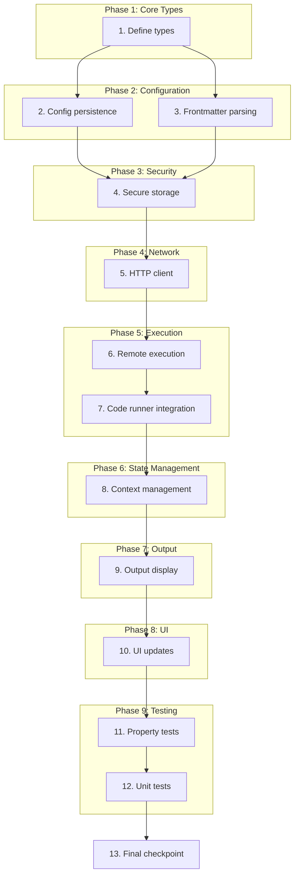

# Implementation Plan: Remote Code Execution

## Overview

This task list implements remote code execution for Velotype. The implementation adds remote server configuration, secure credential storage, connection pooling, and context management while maintaining the app's lightweight requirements. Tasks are ordered to build incremental functionality with checkpoints for validation.

## Task Dependency Graph

```json
{
  "waves": [
    ["1. Define types"],
    ["2. Config persistence", "3. Frontmatter parsing"],
    ["4. Secure storage"],
    ["5. HTTP client"],
    ["6. Remote execution"],
    ["7. Code runner integration"],
    ["8. Context management"],
    ["9. Output display"],
    ["10. UI updates"],
    ["11. Property tests", "12. Unit tests"],
    ["13. Final checkpoint"]
  ]
}
```



## Tasks

- [ ] 1. Define remote execution types and data structures
  - Create new `remote_execution` module in `src/code_runner/`
  - Define `ServerConfig` struct with hostname, port, protocol, auth_method, timeout_ms, fallback_to_local fields
  - Define `CodeRunRequest` and `CodeRunResponse` structs for request/response data
  - Define `ExecutionMode` enum (Local, Remote)
  - Define `AuthenticationMethod` enum (Apikey, BearerToken, SshKey, None)
  - _Requirements: 3.4, 11.4, 12.4_

- [ ] 2. Implement configuration persistence
  - [ ] 2.1 Add `RemoteExecutionConfig` struct to `src/config/preferences.rs`
    - Include fields for global server configuration and user preferences
    - Add methods for loading/saving config from persistent storage
    - _Requirements: 7.1, 7.2, 7.3, 7.4_
  
  - [ ] 2.2 Implement `load_remote_execution_config()` function
    - Load config from persistent storage (or return defaults if not found)
    - Handle missing config file gracefully
    - _Requirements: 7.2_
  
  - [ ] 2.3 Implement `save_remote_execution_config()` function
    - Serialize and persist config to storage
    - Handle serialization errors gracefully
    - _Requirements: 7.1_
  
  - [ ] 2.4 Implement `delete_remote_execution_config()` function
    - Remove stored config from persistent storage
    - _Requirements: 7.3_

- [ ] 3. Implement frontmatter parsing for per-document server configuration
  - [ ] 3.1 Add `parse_server_config_from_frontmatter()` function
    - Parse markdown frontmatter for `remote_server` section
    - Extract server configuration values
    - Return `ServerConfig` or error for invalid config
    - _Requirements: 3.1, 3.3_
  
  - [ ] 3.2 Add `get_document_server_config()` function
    - Load document content and parse frontmatter
    - Return frontmatter config if valid, otherwise return global config
    - Log errors for invalid frontmatter and notify user
    - _Requirements: 3.1, 3.2, 3.3_
  
  - [ ] 3.3 Implement `validate_server_config()` function
    - Validate required fields (hostname, port, protocol)
    - Return validation errors for invalid config
    - _Requirements: 3.3_

- [ ] 4. Implement secure credential storage
  - [ ] 4.1 Add `CredentialStorage` struct for secure credential management
    - Use platform-specific secure storage (Keychain on macOS, Credential Manager on Windows, libsecret on Linux)
    - Implement `store_credentials()`, `load_credentials()`, `delete_credentials()` methods
    - Encrypt credentials before storage using a key derived from application identity
    - _Requirements: 4.1, 11.1, 11.2, 11.3, 11.4_
  
  - [ ] 4.2 Add `CredentialManager` struct for credential lifecycle management
    - Implement `authenticate_server()` that loads stored credentials or prompts user
    - Implement credential expiration checking
    - Implement retry logic for authentication failures (up to 3 retries)
    - _Requirements: 4.2, 4.3, 4.4_

- [ ] 5. Implement HTTP/HTTPS client with connection pooling
  - [ ] 5.1 Add `ConnectionPool` struct for managing HTTP clients
    - Use reqwest's built-in connection pooling
    - Implement per-server connection limits (configurable, default 10)
    - Implement idle connection timeout (configurable, default 60 seconds)
    - _Requirements: 8.1, 8.2, 8.3, 8.4_
  
  - [ ] 5.2 Add `get_http_client()` function
    - Retrieve HTTP client from pool or create new one
    - Handle connection pool errors gracefully
    - Implement retry for connection failures (up to 3 retries)
    - _Requirements: 8.1, 8.2, 12.2_
  
  - [ ] 5.3 Add `build_auth_headers()` function
    - Build HTTP headers for authentication based on `AuthenticationMethod`
    - Support API_KEY (X-API-Key header)
    - Support BEARER_TOKEN (Authorization: Bearer header)
    - Support SSH_KEY (include in request body or header as needed)
    - _Requirements: 4.2, 11.4_

- [ ] 6. Implement remote code execution
  - [ ] 6.1 Add `execute_on_remote_server()` function
    - Create `CodeRunRequest` from code and language
    - Add authentication headers using `build_auth_headers()`
    - Send request to remote server via HTTP/HTTPS
    - Parse response and return `CodeRunResponse`
    - Handle network errors and server errors
    - _Requirements: 1.1, 1.4, 10.1, 10.2, 10.3_
  
  - [ ] 6.2 Add `execute_with_timeout()` function
    - Use tokio's timeout to enforce execution timeout
    - Cancel request on timeout and return timeout error
    - Include timeout in error message
    - _Requirements: 10.1, 10.2, 10.3_
  
  - [ ] 6.3 Add `size_check_with_warning()` function
    - Check code block size against 100KB limit
    - Display warning dialog for large code blocks
    - Return error if user cancels
    - _Requirements: 2.4_

- [ ] 7. Update code runner to handle remote execution
  - [ ] 7.1 Update `spawn_code_run()` function signature
    - Add `document_path` parameter for configuration loading
    - Add `execution_mode` parameter (Local or Remote)
    - _Requirements: 1.1, 1.5_
  
  - [ ] 7.2 Implement `execute_code_block()` function
    - Load server configuration for document
    - Check for remote vs local execution based on config
    - Call appropriate execution function (local or remote)
    - Handle fallback to local execution on remote failure
    - Display appropriate warnings for failures
    - _Requirements: 1.1, 1.4, 1.5_
  
  - [ ] 7.3 Implement `display_execution_status()` function
    - Update UI status to "Running" during execution
    - Stream progress updates from code block
    - _Requirements: 1.2_

- [ ] 8. Implement execution context management
  - [ ] 8.1 Add `ExecutionSession` struct for state management
    - Include session_id, context_id, context_data (Map<String, Any>)
    - Include created_at, last_activity timestamps
    - Include server_config reference
    - _Requirements: 6.1, 6.2, 6.3, 6.4, 9.1, 9.2, 9.3, 9.4_
  
  - [ ] 8.2 Add `ContextManager` struct for session lifecycle
    - Implement `create_session()` for new sessions
    - Implement `get_session()` for retrieving existing sessions
    - Implement `update_session_context()` for state updates
    - Implement `reset_session_context()` for explicit resets
    - Implement persistence based on strategy (SESSION_ONLY, DOCUMENT_OPEN, PERSISTENT)
    - _Requirements: 6.1, 6.2, 6.3, 6.4, 9.1, 9.2, 9.3, 9.4, 7.1, 7.2, 7.3, 7.4_
  
  - [ ] 8.3 Add `derive_context_id_from_path()` function
    - Derive context ID from document path
    - Use hash of path for consistent but non-reversible ID
    - _Requirements: 9.3_

- [ ] 9. Implement output display
  - [ ] 9.1 Add `OutputDisplayOptions` enum (ExternalTerminal, BuiltIn)
    - Include user preference for output destination
    - _Requirements: 5.1, 5.2_
  
  - [ ] 9.2 Add `format_execution_output()` function
    - Format output with code snippet, input parameters, results, execution time, and errors
    - Truncate output at 10,000 characters if needed
    - Include "view full output" option for truncated output
    - _Requirements: 5.3, 5.4_
  
  - [ ] 9.3 Add `display_execution_result()` function
    - Route output to external terminal or built-in display based on preference
    - Use existing `system_terminal::open_in_system_terminal()` for external output
    - Update existing code block UI for built-in display
    - _Requirements: 5.1, 5.2, 1.3_
  
  - [ ] 9.4 Update `display_execution_status()` function
    - Update UI status to "Done" on completion
    - Display output, exit code, and execution time
    - _Requirements: 1.3_

- [ ] 10. Update UI for remote execution
  - [ ] 10.1 Add remote execution UI components
    - Create remote execution configuration UI for server settings
    - Create authentication configuration UI for credentials
    - Create output display options UI for user preferences
    - _Requirements: 3.4, 4.1, 5.1, 5.2_
  
  - [ ] 10.2 Update code block rendering
    - Show execution mode indicator (Local/Remote)
    - Show execution status (Idle/Running/Done/Failed)
    - Show server configuration indicator when using remote execution
    - _Requirements: 1.1, 1.2, 1.3, 1.4_

- [ ] 11. Add property-based tests for correctness properties
  - [ ] 11.1 Write property test for Property 1: Remote execution when configured
    - **Property 1: Remote execution when configured**
    - **Validates: Requirements 1.1**
    - For any code block, document with valid remote server configuration, and execution request, if remote execution is enabled and the server is available, the system shall send the code to the remote server and return the server's response.
  
  - [ ] 11.2 Write property test for Property 2: Fallback to local execution on failure
    - **Property 2: Fallback to local execution on failure**
    - **Validates: Requirements 1.1, 1.4**
    - For any code block and server configuration, if the remote server is unavailable or returns an error, the system shall fall back to local execution and return the local execution results.
  
  - [ ] 11.3 Write property test for Property 11: Per-document configuration priority
    - **Property 11: Per-document configuration priority**
    - **Validates: Requirements 3.1**
    - For any markdown document with valid frontmatter server configuration, the system shall use that configuration instead of the global default.
  
  - [ ] 11.4 Write property test for Property 14: Secure credential storage
    - **Property 14: Secure credential storage**
    - **Validates: Requirements 4.1, 11.3**
    - For any user-provided authentication credentials, the system shall store them securely and not expose them in logs or error messages.
  
  - [ ] 11.5 Write property test for Property 22: Context persistence across executions
    - **Property 22: Context persistence across executions**
    - **Validates: Requirements 6.1, 6.3**
    - For any sequence of code blocks executed within the same session, the system shall maintain execution context (variables, loaded modules) between executions.
  
  - [ ] 11.6 Write property test for Property 26: Configuration persistence
    - **Property 26: Configuration persistence**
    - **Validates: Requirements 7.1, 7.2**
    - For any server configuration, the system shall persist it to storage and load it on application restart.
  
  - [ ] 11.7 Write property test for Property 29: Connection reuse
    - **Property 29: Connection reuse**
    - **Validates: Requirements 8.1**
    - For any multiple code executions targeting the same server, the system shall reuse existing connections from the pool.
  
  - [ ] 11.8 Write property test for Property 33: Context isolation between documents
    - **Property 33: Context isolation between documents**
    - **Validates: Requirements 9.1, 9.4**
    - For any code blocks executed from different documents, the system shall maintain separate execution contexts.
  
  - [ ] 11.9 Write property test for Property 37: Timeout application
    - **Property 37: Timeout application**
    - **Validates: Requirements 10.1, 10.2**
    - For any code execution, the system shall apply the configured timeout from the server configuration.
  
  - [ ] 11.10 Write property test for Property 45: Error catching
    - **Property 45: Error catching**
    - **Validates: Requirements 12.1, 12.4**
    - For any remote execution failure, the system shall catch the error and display a user-friendly message.

- [ ] 12. Add unit tests for edge cases and error conditions
  - [ ] 12.1 Write unit tests for invalid frontmatter handling
    - Test invalid YAML syntax in frontmatter
    - Test missing required fields
    - Test invalid port numbers
    - _Requirements: 3.3_
  
  - [ ] 12.2 Write unit tests for authentication retry logic
    - Test authentication with invalid credentials (should fail)
    - Test authentication with retry and eventual success
    - Test authentication with 3 failed retries (should give up)
    - _Requirements: 4.4_
  
  - [ ] 12.3 Write unit tests for connection pool limits
    - Test exceeding connection pool limit (should queue)
    - Test idle connection cleanup
    - Test stale connection detection and reconnection
    - _Requirements: 8.4_
  
  - [ ] 12.4 Write unit tests for context isolation
    - Test context data from one document not accessible from another
    - Test custom context IDs are used correctly
    - Test document path derived context IDs work correctly
    - _Requirements: 9.4_
  
  - [ ] 12.5 Write unit tests for error context
    - Test errors include document path
    - Test errors include code language
    - Test errors include server configuration
    - _Requirements: 12.4_

- [ ] 13. Checkpoint - Ensure all tests pass
  - Ensure all tests pass, ask the user if questions arise.

## Notes

- Tasks marked with `*` are optional and can be skipped for faster MVP
- Each task references specific requirements for traceability
- Checkpoints ensure incremental validation
- Property tests validate universal correctness properties
- Unit tests validate specific examples and edge cases
- Implementation uses existing reqwest HTTP client for connection pooling
- Secure storage uses platform-specific APIs (Keychain, Credential Manager, libsecret)
- Context persistence supports three modes: session-only, document-open, and persistent
- Remote execution configuration supports per-document and global server configurations