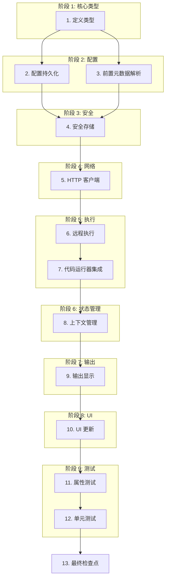

# 实施计划: 远程代码执行

## 概述

此任务列表为 Velotype 实现远程代码执行。实施添加了远程服务器配置、安全凭据存储、连接池和上下文管理,同时保持应用程序的轻量级要求。任务按顺序排列,以构建增量功能并进行验证检查点。

## 任务依赖图

```json
{
  "waves": [
    ["1. 定义类型"],
    ["2. 配置持久化", "3. 前置元数据解析"],
    ["4. 安全存储"],
    ["5. HTTP 客户端"],
    ["6. 远程执行"],
    ["7. 代码运行器集成"],
    ["8. 上下文管理"],
    ["9. 输出显示"],
    ["10. UI 更新"],
    ["11. 属性测试", "12. 单元测试"],
    ["13. 最终检查点"]
  ]
}
```



## 任务

- [ ] 1. 定义远程执行类型和数据结构
  - 在 `src/code_runner/` 中创建新的 `remote_execution` 模块
  - 定义 `ServerConfig` 结构体,包含 hostname、port、protocol、auth_method、timeout_ms、fallback_to_local 字段
  - 定义 `CodeRunRequest` 和 `CodeRunResponse` 结构体用于请求/响应数据
  - 定义 `ExecutionMode` 枚举(Local、Remote)
  - 定义 `AuthenticationMethod` 枚举(Apikey、BearerToken、SshKey、None)
  - _需求: 3.4, 11.4, 12.4_

- [ ] 2. 实现配置持久化
  - [ ] 2.1 在 `src/config/preferences.rs` 中添加 `RemoteExecutionConfig` 结构体
    - 包含全局服务器配置和用户首选项的字段
    - 添加从持久存储加载/保存配置的方法
    - _需求: 7.1, 7.2, 7.3, 7.4_
  
  - [ ] 2.2 实现 `load_remote_execution_config()` 函数
    - 从持久存储加载配置(如果未找到则返回默认值)
    - 优雅地处理缺失的配置文件
    - _需求: 7.2_
  
  - [ ] 2.3 实现 `save_remote_execution_config()` 函数
    - 序列化并持久化配置到存储
    - 优雅地处理序列化错误
    - _需求: 7.1_
  
  - [ ] 2.4 实现 `delete_remote_execution_config()` 函数
    - 从持久存储中移除存储的配置
    - _需求: 7.3_

- [ ] 3. 实现前置元数据解析以进行每文档服务器配置
  - [ ] 3.1 添加 `parse_server_config_from_frontmatter()` 函数
    - 解析 Markdown 前置元数据中的 `remote_server` 部分
    - 提取服务器配置值
    - 对无效配置返回 `ServerConfig` 或错误
    - _需求: 3.1, 3.3_
  
  - [ ] 3.2 添加 `get_document_server_config()` 函数
    - 加载文档内容并解析前置元数据
    - 如果有效则返回前置元数据配置,否则返回全局配置
    - 记录无效前置元数据的错误并通知用户
    - _需求: 3.1, 3.2, 3.3_
  
  - [ ] 3.3 实现 `validate_server_config()` 函数
    - 验证必需字段(hostname、port、protocol)
    - 对无效配置返回验证错误
    - _需求: 3.3_

- [ ] 4. 实现安全凭据存储
  - [ ] 4.1 添加 `CredentialStorage` 结构体进行安全凭据管理
    - 使用平台特定的安全存储(macOS 上的 Keychain、Windows 上的 Credential Manager、Linux 上的 libsecret)
    - 实现 `store_credentials()`、`load_credentials()`、`delete_credentials()` 方法
    - 使用从应用身份派生的密钥在存储前加密凭据
    - _需求: 4.1, 11.1, 11.2, 11.3, 11.4_
  
  - [ ] 4.2 添加 `CredentialManager` 结构体进行凭据生命周期管理
    - 实现 `authenticate_server()` 加载存储的凭据或提示用户
    - 实现凭据过期检查
    - 实现认证失败的重试逻辑(最多 3 次重试)
    - _需求: 4.2, 4.3, 4.4_

- [ ] 5. 实现带连接池的 HTTP/HTTPS 客户端
  - [ ] 5.1 添加 `ConnectionPool` 结构体管理 HTTP 客户端
    - 使用 reqwest 的内置连接池
    - 实现每服务器连接限制(可配置,默认 10)
    - 实现空闲连接超时(可配置,默认 60 秒)
    - _需求: 8.1, 8.2, 8.3, 8.4_
  
  - [ ] 5.2 添加 `get_http_client()` 函数
    - 从池中检索 HTTP 客户端或创建新客户端
    - 优雅地处理连接池错误
    - 实现连接失败的重试(最多 3 次)
    - _需求: 8.1, 8.2, 12.2_
  
  - [ ] 5.3 添加 `build_auth_headers()` 函数
    - 根据 `AuthenticationMethod` 构建 HTTP 头用于认证
    - 支持 API_KEY (X-API-Key 头)
    - 支持 BEARER_TOKEN (Authorization: Bearer 头)
    - 支持 SSH_KEY (根据需要包含在请求体或头中)
    - _需求: 4.2, 11.4_

- [ ] 6. 实现远程代码执行
  - [ ] 6.1 添加 `execute_on_remote_server()` 函数
    - 从代码和语言创建 `CodeRunRequest`
    - 使用 `build_auth_headers()` 添加认证头
    - 通过 HTTP/HTTPS 发送请求到远程服务器
    - 解析响应并返回 `CodeRunResponse`
    - 处理网络错误和服务器错误
    - _需求: 1.1, 1.4, 10.1, 10.2, 10.3_
  
  - [ ] 6.2 添加 `execute_with_timeout()` 函数
    - 使用 tokio 的超时强制执行执行超时
    - 超时时取消请求并返回超时错误
    - 在错误消息中包含超时
    - _需求: 10.1, 10.2, 10.3_
  
  - [ ] 6.3 添加 `size_check_with_warning()` 函数
    - 检查代码块大小是否超过 100KB 限制
    - 对大代码块显示警告对话框
    - 如果用户取消则返回错误
    - _需求: 2.4_

- [ ] 7. 更新代码运行器以处理远程执行
  - [ ] 7.1 更新 `spawn_code_run()` 函数签名
    - 添加 `document_path` 参数用于配置加载
    - 添加 `execution_mode` 参数(Local 或 Remote)
    - _需求: 1.1, 1.5_
  
  - [ ] 7.2 实现 `execute_code_block()` 函数
    - 为文档加载服务器配置
    - 根据配置检查远程或本地执行
    - 调用适当的执行函数(本地或远程)
    - 在远程失败时处理回退到本地执行
    - 显示适当的失败警告
    - _需求: 1.1, 1.4, 1.5_
  
  - [ ] 7.3 实现 `display_execution_status()` 函数
    - 在执行期间将 UI 状态更新为"运行中"
    - 从代码块流式传输进度更新
    - _需求: 1.2_

- [ ] 8. 实现执行上下文管理
  - [ ] 8.1 添加 `ExecutionSession` 结构体用于状态管理
    - 包括 session_id、context_id、context_data (Map<String, Any>)
    - 包括 created_at、last_activity 时间戳
    - 包括 server_config 引用
    - _需求: 6.1, 6.2, 6.3, 6.4, 9.1, 9.2, 9.3, 9.4_
  
  - [ ] 8.2 添加 `ContextManager` 结构体用于会话生命周期
    - 为新会话实现 `create_session()`
    - 为检索现有会话实现 `get_session()`
    - 为状态更新实现 `update_session_context()`
    - 为显式重置实现 `reset_session_context()`
    - 根据策略实现持久化(SESSION_ONLY、DOCUMENT_OPEN、PERSISTENT)
    - _需求: 6.1, 6.2, 6.3, 6.4, 9.1, 9.2, 9.3, 9.4, 7.1, 7.2, 7.3, 7.4_
  
  - [ ] 8.3 添加 `derive_context_id_from_path()` 函数
    - 从文档路径推导上下文 ID
    - 使用路径的哈希值以获得一致但不可逆的 ID
    - _需求: 9.3_

- [ ] 9. 实现输出显示
  - [ ] 9.1 添加 `OutputDisplayOptions` 枚举(ExternalTerminal、BuiltIn)
    - 包括用户对输出目标的首选项
    - _需求: 5.1, 5.2_
  
  - [ ] 9.2 添加 `format_execution_output()` 函数
    - 使用代码片段、输入参数、结果、执行时间和错误格式化输出
    - 如果需要,在 10,000 个字符处截断输出
    - 为截断的输出包括"查看完整输出"选项
    - _需求: 5.3, 5.4_
  
  - [ ] 9.3 添加 `display_execution_result()` 函数
    - 根据首选项将输出路由到外部终端或内置显示
    - 使用现有的 `system_terminal::open_in_system_terminal()` 进行外部输出
    - 更新现有的代码块 UI 用于内置显示
    - _需求: 5.1, 5.2, 1.3_
  
  - [ ] 9.4 更新 `display_execution_status()` 函数
    - 完成时将 UI 状态更新为"已完成"
    - 显示输出、退出码和执行时间
    - _需求: 1.3_

- [ ] 10. 更新远程执行的 UI
  - [ ] 10.1 添加远程执行 UI 组件
    - 为服务器设置创建远程执行配置 UI
    - 为凭据创建认证配置 UI
    - 为用户首选项创建输出显示选项 UI
    - _需求: 3.4, 4.1, 5.1, 5.2_
  
  - [ ] 10.2 更新代码块渲染
    - 显示执行模式指示器(Local/Remote)
    - 显示执行状态(空闲/运行中/已完成/失败)
    - 使用远程执行时显示服务器配置指示器
    - _需求: 1.1, 1.2, 1.3, 1.4_

- [ ] 11. 为正确性属性添加基于属性的测试
  - [ ] 11.1 为属性 1 编写属性测试:配置时远程执行
    - **属性 1: 配置时远程执行**
    - **验证: 需求 1.1**
    - 对于任何代码块、具有有效远程服务器配置的文档和执行请求,如果启用了远程执行且服务器可用,系统应将代码发送到远程服务器并返回服务器的响应。
  
  - [ ] 11.2 为属性 2 编写属性测试:失败时回退到本地执行
    - **属性 2: 失败时回退到本地执行**
    - **验证: 需求 1.1, 1.4**
    - 对于任何代码块和服务器配置,如果远程服务器不可用或返回错误,系统应回退到本地执行并返回本地执行结果。
  
  - [ ] 11.3 为属性 11 编写属性测试:每文档配置优先
    - **属性 11: 每文档配置优先**
    - **验证: 需求 3.1**
    - 对于任何 Markdown 文档,如果前置元数据中具有有效的服务器配置,系统应使用该配置而不是全局默认。
  
  - [ ] 11.4 为属性 14 编写属性测试:安全凭据存储
    - **属性 14: 安全凭据存储**
    - **验证: 需求 4.1, 11.3**
    - 对于任何用户提供的认证凭据,系统应安全地存储它们,并且不在日志或错误消息中暴露。
  
  - [ ] 11.5 为属性 22 编写属性测试:执行之间的上下文持久化
    - **属性 22: 执行之间的上下文持久化**
    - **验证: 需求 6.1, 6.3**
    - 对于在同一个会话内顺序执行的代码块序列,系统应在执行之间维护执行上下文(变量、加载的模块)。
  
  - [ ] 11.6 为属性 26 编写属性测试:配置持久化
    - **属性 26: 配置持久化**
    - **验证: 需求 7.1, 7.2**
    - 对于任何服务器配置,系统应将其持久化到存储并在应用程序重启时加载。
  
  - [ ] 11.7 为属性 29 编写属性测试:连接重用
    - **属性 29: 连接重用**
    - **验证: 需求 8.1**
    - 对于指向同一服务器的多个代码执行,系统应从池中重用现有连接。
  
  - [ ] 11.8 为属性 33 编写属性测试:文档间的上下文隔离
    - **属性 33: 文档间的上下文隔离**
    - **验证: 需求 9.1, 9.4**
    - 对于从不同文档执行的代码块,系统应维护单独的执行上下文。
  
  - [ ] 11.9 为属性 37 编写属性测试:超时应用
    - **属性 37: 超时应用**
    - **验证: 需求 10.1, 10.2**
    - 对于任何代码执行,系统应应用服务器配置中配置的超时。
  
  - [ ] 11.10 为属性 45 编写属性测试:错误捕获
    - **属性 45: 错误捕获**
    - **验证: 需求 12.1, 12.4**
    - 对于任何远程执行失败,系统应捕获错误并显示用户友好的消息。

- [ ] 12. 为边缘情况和错误条件添加单元测试
  - [ ] 12.1 为无效前置元数据处理编写单元测试
    - 测试前置元数据中的无效 YAML 语法
    - 测试缺失的必需字段
    - 测试无效的端口号
    - _需求: 3.3_
  
  - [ ] 12.2 为认证重试逻辑编写单元测试
    - 测试使用无效凭据认证(应该失败)
    - 测试认证重试最终成功
    - 测试认证 3 次重试失败后放弃
    - _需求: 4.4_
  
  - [ ] 12.3 为连接池限制编写单元测试
    - 测试超出连接池限制(应该排队)
    - 测试空闲连接清理
    - 测试旧连接检测和重新连接
    - _需求: 8.4_
  
  - [ ] 12.4 为上下文隔离编写单元测试
    - 测试一个文档的上下文数据不可从另一个文档访问
    - 测试自定义上下文 ID 使用正确
    - 测试文档路径推导的上下文 ID 工作正确
    - _需求: 9.4_
  
  - [ ] 12.5 为错误上下文编写单元测试
    - 测试错误包括文档路径
    - 测试错误包括代码语言
    - 测试错误包括服务器配置
    - _需求: 12.4_

- [ ] 13. 检查点 - 确保所有测试通过
  - 确保所有测试通过,如果出现问题请询问用户。

## 注意

- 标有 `*` 的任务是可选的,可以跳过以快速构建 MVP
- 每个任务引用特定的需求以实现可追溯性
- 检查点确保增量验证
- 属性测试验证普遍正确性属性
- 单元测试验证具体示例和边缘情况
- 实施使用现有的 reqwest HTTP 客户端进行连接池
- 安全存储使用平台特定的 API(Keychain、Credential Manager、libsecret)
- 上下文持久化支持三种模式:仅会话、文档打开和持久化
- 远程执行配置支持每文档和全局服务器配置
