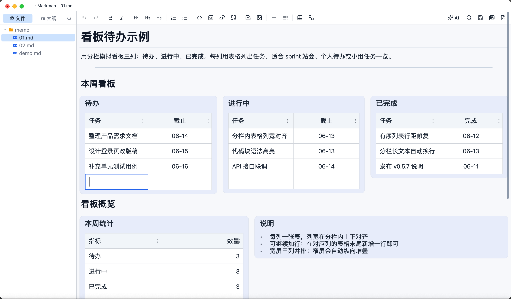

# Markman

<div align="center">


**A native Markdown memo app built with Rust and GPUI — WYSIWYG editing, source mode, and a full workspace.**



[Editor Showcase](./assets/showcase/showcase.md)

[English](README.md) | [中文](docs/README.zh-CN.md)

[](https://www.rust-lang.org/)
[](https://gpui.rs/)
[](#quick-start)
[](#features)
[](#features)
[](https://github.com/meetrize/markmemo/releases)
[](LICENSE)

</div>

Markman is a block-based Markdown editor and memo app powered by Rust and [GPUI](https://gpui.rs/). Edit in rendered WYSIWYG mode or switch to Markdown source — no WebView, no preview-pane sync loop.

> **Note:** The display name is **Markman**. The executable and CLI command remain `velotype` for compatibility with existing scripts and releases.

## Features

### Editing experience

- **Block model** — Markdown structure lives in an editable block tree; parsing and rendering stay in sync without a separate preview pane.
- **Dual view modes** — WYSIWYG rendered editing and raw Markdown source mode with line numbers.
- **Format toolbar** — One-click formatting for headings, bold, italic, lists, tasks, quotes, links, images, tables, and more.
- **Rich navigation** — Word-by-word and block-by-block movement, cross-block selection, double-click word select, and configurable keyboard shortcuts.
- **Document tools** — In-document search, global search, quick-open file picker, auto-save, and context menus (copy, cut, paste, select all).

### Workspace

- **Folder workspace** — Open a directory, browse files in a side drawer, and jump between notes quickly.
- **Outline panel** — Navigate document structure from headings and blocks.
- **Workspace search** — Search across files with match highlighting and jump-to-result.

### Markdown & content

- **Common syntax** — Headings, paragraphs, lists, task lists, quotes, callouts, tables, footnotes, reference-style links and images, standalone images, and comment blocks.
- **Column blocks** — Multi-column layout blocks with inline tree preview.
- **Code blocks** — Tree-sitter syntax highlighting, line numbers, folding, language picker, copy, and run-in-terminal with an expandable output panel.
- **Inline code** — Run snippets in the system terminal directly from rendered mode.
- **Mermaid** — Render diagrams in the editor; insert from built-in templates.
- **Tables** — Adjustable column widths and extended cell border styling.
- **Safe HTML** — Controlled native HTML handling where supported.
- **Math & extras** — Superscript/subscript inline editing; RaTeX-based math rendering where enabled.

### AI assistance

- **Selection-aware AI** — Invoke AI on the current selection or block context.
- **Streaming responses** — Results stream in with a draggable preview panel and scroll support.
- **Custom prompts** — Save and reuse prompt buttons from the toolbar or preferences.

### Export & customization

- **HTML & PDF export** — HTML maps the active theme to CSS; PDF reuses the same themed pipeline via local Chromium.
- **Themes** — Import JSONC theme packs for colors, typography, spacing, menus, dialogs, code highlighting, and layout tokens.
- **Language packs** — Partial JSONC locale files with English fallback.
- **Global hotkey** — Toggle app visibility from anywhere on supported platforms.

### Platform

- **Native GPUI UI** — No Electron, Tauri, or WebView shell.
- **Portable binary** — Single executable after build; runs on Windows, Linux, and macOS.
- **macOS packaging** — `.app` bundle or PKG installer with optional CLI symlink setup.

## Quick Start

### 1. Download a release

Download the build for your platform from [GitHub Releases](https://github.com/meetrize/markmemo/releases).

#### Windows and Linux

1. Download the `.zip` or `.tar.gz` archive for your platform.
2. Extract the `velotype` executable.
3. Run it directly.

#### macOS

**Option 1: `.app` bundle**

1. Download `velotype-*.zip`.
2. Unzip to get `Markman.app` (or `Velotype.app` on older releases).
3. Drag to `/Applications` or run in place.

**Option 2: PKG installer (recommended)**

1. Download `velotype-*.pkg`.
2. Run the installer — the app is placed in `/Applications`.
3. The `velotype` CLI command is configured automatically.

> **CLI note:** PKG installs manage the `/usr/local/bin/velotype` symlink via `postinstall` / `preuninstall` scripts. For `.app`-only installs, use **Help → Install CLI Command** inside the app. Moving or deleting the app bundle breaks the symlink.

### 2. Build from source

Prerequisites:

- Git
- Rust toolchain with **2024 edition** support
- Cargo
- Platform build dependencies required by GPUI

```bash
git clone https://github.com/meetrize/markmemo.git
cd markmemo
cargo build --release
```

The binary is at `target/release/velotype`.

For development, testing, and packaging, see the [Development & Build guide](docs/development.md).

## Roadmap

Markman already covers most day-to-day Markdown authoring needs. Planned work includes:

- [x] Performance for very large documents
- [x] Workspace mode and outline navigation
- [ ] Built-in image hosting
- [ ] More complete IME behavior

## Theme & language customization

Theme and UI language are managed separately. Theme files can override global colors, fonts, sizes, menus, dialogs, table controls, image placeholders, code highlighting, and layout tokens. Missing fields inherit the base theme (`velotype` or `velotype-light` via `base_theme_id`).

Language packs use the same partial-config approach — missing strings fall back to English.

Example files:

- [Custom theme JSONC](assets/custom-theme.example.jsonc)
- [Custom language JSONC](assets/custom-language.example.jsonc)

Import via **Theme → Add Theme Config** or **Language → Add Language Config** in the app. JSONC comments are accepted on import; saved configs are normalized to strict JSON.

## Architecture

| Layer | Responsibility |
| --- | --- |
| `editor` | Window state: view mode, save/close, undo, selection, source mapping, tree mutation, export, workspace, AI, and file drop. |
| `components::block` | Editable block runtime, GPUI input, rendering, block events, image/table/code runtime state. |
| `components::markdown` | Markdown models and parse/serialize helpers for inline text, links, images, footnotes, tables, HTML, and code highlighting. |
| `config` | App behavior and theme configuration. |
| `export` | HTML and PDF export pipelines. |
| `theme` | Visual tokens, built-in defaults, custom theme import, global theme manager. |
| `i18n` | Built-in UI strings, language packs, locale matching, runtime language selection. |
| `net` | HTTP client for remote image loading. |

The editor uses a native block tree as its runtime model. Supported Markdown is converted to structured blocks on import and serialized back to canonical Markdown on save. Unstable syntax is preserved as raw source and remains visible and editable.

## Contributing

This repository moves quickly. When reporting parsing or rendering issues, please use the [issue template](https://github.com/meetrize/markmemo/issues/new/choose) so problems can be reproduced.

For code changes, prefer small patches on the `dev` branch and extend the existing parser/runtime model rather than replacing it wholesale.

## License

Markman is licensed under the [Apache License 2.0](LICENSE).

## Star History

[](https://api.star-history.com/chart?repos=meetrize/markmemo&type=date&legend=top-left)
