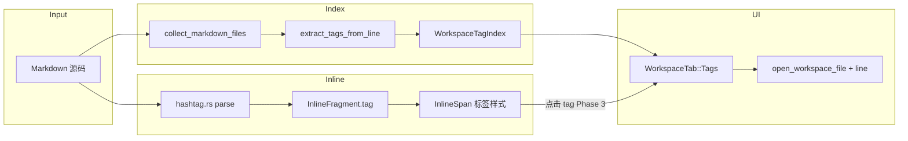

# 行内标签 `#tag` — 方案设计

本文档描述 Velotype / Markman 中 **Obsidian 风格行内标签** `#tag` 的功能设计、标签云索引架构，与现有 inline / 工作区面板的映射关系，以及分阶段实施计划。可直接复制各 Phase 内容交给 AI Agent 执行。

[开发与构建](development.zh-CN.md) | [Hook 自动开发步骤](hashtag-tag-hook-steps.zh-CN.md) | [Wiki 链接方案](wiki-link-implementation.zh-CN.md) | [行内代码执行](inline-code-run-implementation.zh-CN.md)

---

## 需求概述

用户在 Markdown 正文段落中输入 `#标签名` 时：

| 场景 | 期望行为 |
| --- | --- |
| **预览（渲染模式）** | 显示为带主题色的标签样式（chip / pill），与正文区分 |
| **编辑** | 源码与渲染投影均保留 `#标签名` 字面量，可正常光标移动与删除 |
| **标签云索引** | 扫描工作区内 Markdown 文件，汇总所有标签及引用次数 |
| **侧栏标签面板** | 展示标签列表或标签云；点击标签列出引用该标签的文件与片段 |
| **跳转** | 点击标签结果项，打开对应文件并定位到匹配位置（复用工作区搜索跳转） |

本功能**不**改变块级标题语法（行首 `# 标题` 仍由 Block 模型处理）。

---

## 语法定义

### MVP（Phase 1）

```markdown
今天完成了 #rust 模块重构，关联 #project/alpha 里程碑。
笔记里也可以写 #工作 与 #2024-plan。
```

| 规则 | 说明 |
| --- | --- |
| **触发字符** | 行内 `#` 后**紧跟**标签体，中间不能有空格 |
| **标签体字符** | Unicode 字母、数字、`_`、`-`、`/`（支持层级如 `#a/b`） |
| **最小长度** | 标签体至少 1 个字符 |
| **排除 hex 色值** | `#` 后若为恰好 3 或 6 位十六进制（如 `#fff`、`#1a2b3c`），视为普通文本，**不**解析为标签 |
| **代码 span 内** | 与链接、emoji 一致，代码 span 内 `#` 为字面量 |
| **转义** | `\#tag` 为字面量，不解析 |
| **块级标题** | 行首 `# ` / `## ` 等由块解析器处理，inline 解析器不负责 |

**源码存储**：`#tag-name`（含 `#`）

**预览显示**：`#tag-name`（与源码一致，便于 WYSIWYG 对齐）

**规范化（索引用）**：标签名统一为小写；`#Project/Alpha` 与 `#project/alpha` 视为同一标签（与 Obsidian 惯例一致，具体规则见「已确认决策」）。

### 可选扩展（Phase 4 及以后）

| 语法 | 含义 |
| --- | --- |
| `#tag\|alias` | 自定义显示别名（类似 Wiki `\|` 语法，低优先级） |
| 标签别名表 | 配置文件中将多个名称映射到同一 canonical tag |
| YAML front matter 标签 | `tags: [a, b]` 与行内 `#tag` 合并索引 |
| 标签页 / 反向链接面板 | 展示「引用此标签的其他笔记」 |

Phase 1–3 不实现扩展语法；解析器与索引结构应预留 `canonical_name` 字段。

---

## 与现有架构的映射

行内标签与 Wiki 链接、emoji 同属 **inline fragment 元数据**，但语义是「分类索引」而非「导航链接」。推荐新增独立字段，而非扩展 `InlineLink`。

| 能力 | 现有模块 | 标签用法 |
| --- | --- | --- |
| 解析 | `src/components/markdown/inline/normalize.rs` | 在 emoji 解析之后、普通文本 emit 之前识别 `#tag` |
| 数据模型 | `src/components/markdown/inline/fragment.rs` | 新增 `tag: Option<InlineTag>` |
| 序列化 | `src/components/markdown/inline/mod.rs` — `serialize_markdown` | 按 fragment 的 `tag` 元数据输出 `#name` |
| 预览渲染 | `InlineRenderCache` + `InlineSpan` | 新增 `tag: Option<InlineTagHit>`，渲染 chip 样式 |
| 聚焦编辑 / 投影 | `src/components/block/runtime/projection.rs` | Phase 1 无需展开分隔符；标签文本即 fragment.text |
| 主题色 | `src/theme/theme.rs` — `text_link` | 新增 `text_tag`、`tag_background`（或复用 callout accent 系列） |
| 工作区扫描 | `src/editor/workspace.rs` — `collect_markdown_files` | 复用 Markdown 文件枚举 |
| 跨文件搜索 | `src/editor/workspace.rs` — `search_markdown_files` | 点击标签后复用结果列表 UI 与跳转逻辑 |
| 文件树侧栏 | `src/editor/workspace.rs` — `WorkspaceTab` | 新增 `Tags` 标签页 |
| HTML 导出 | `src/export/html.rs` | 输出 `<span class="tag">#name</span>` 或保留原文 |

### 标签 vs Wiki 链接 vs emoji

| 特性 | Wiki 链接 | emoji | 行内标签 |
| --- | --- | --- | --- |
| 元数据位置 | `link: InlineLink::WikiLink` | `emoji: InlineEmoji` | `tag: InlineTag` |
| 可见文本 | 路径（无 `[[]]`） | glyph（非 `:shortcode:`） | `#tag`（与源码一致） |
| 投影展开 | `[[` + path + `]]` | 无 | 无（Phase 1） |
| 点击行为 | 打开文件 | 无 | 过滤 / 跳转标签引用（Phase 3） |
| 索引 | 无 | 无 | 工作区标签云 |

### 数据模型草案

```rust
/// Source-preserving inline hashtag metadata.
#[derive(Clone, Debug, PartialEq, Eq)]
pub struct InlineTag {
    /// Canonical tag name without leading `#`, e.g. `project/alpha`.
    pub name: String,
    /// Full Markdown source including `#`, e.g. `#project/alpha`.
    pub source: String,
}

#[derive(Clone, Debug, PartialEq, Eq)]
pub struct InlineTagHit {
    pub name: String,
    pub source: String,
}
```

`InlineFragment` / `InlineSpan` / `InlineInsertionAttributes` 各增加 `tag: Option<...>` 字段；所有 `emoji: None` 初始化处同步补 `tag: None`。

---

## 标签索引架构

### 索引数据结构

```rust
/// One occurrence of a tag inside a workspace markdown file.
pub struct TagOccurrence {
    pub path: PathBuf,           // 绝对路径
    pub line: usize,             // 1-based line number
    pub preview: String,         // 匹配行 trimmed 预览
    pub match_start_byte: usize, // 文件内 UTF-8 byte offset（与 workspace search 一致）
    pub raw_file_len: usize,
}

/// Aggregated workspace tag index.
pub struct WorkspaceTagIndex {
    /// canonical tag name -> sorted occurrences
    pub by_tag: BTreeMap<String, Vec<TagOccurrence>>,
    /// tag -> reference count (occurrences.len())
    pub counts: BTreeMap<String, usize>,
    /// generation / version for cache invalidation
    pub revision: u64,
}
```

### 提取策略

**推荐（Phase 2）**：对每个 Markdown 文件读取 UTF-8 文本，按行扫描 + inline 级解析：

1. 复用 `collect_markdown_files(root)` 枚举 `.md` 文件（与 `search_markdown_files` 相同范围）。
2. 对每行调用轻量函数 `extract_tags_from_line(line) -> Vec<(byte_offset, InlineTag)>`，规则与 `parse_hashtag` **完全一致**（可共享 `is_valid_tag_body` / `locate_hashtag` 辅助函数）。
3. 跳过 fenced code block 行（可用简易状态机：遇到 ` ``` ` 切换 `in_code_fence`）。
4. 块级标题行（`^#{1,6}\s`）不参与行内提取——该行 `#` 属于标题 marker，不是标签。

**为何不全文 regex**：代码块、转义、hex 色值等边界需与编辑器解析一致，否则索引与渲染不同步。

**增量更新（Phase 2.5）**：

| 事件 | 动作 |
| --- | --- |
| 打开工作区 | 全量构建索引（后台 task，完成后 `cx.notify`） |
| 当前文件保存 / 自动保存 | 仅重扫该文件，合并进 `by_tag` |
| 切换工作区根目录 | 清空并全量重建 |
| 外部文件变更（可选 Phase 3） | 文件 watcher 或下次聚焦时 lazy refresh |

索引状态挂在 `WorkspaceState` 或独立 `TagIndexController`（与 `WorkspaceController` 并列），避免阻塞 UI：扫描在 `cx.spawn` 中执行。

### 标签云 UI（Phase 3）

侧栏新增第三个 Tab：`WorkspaceTab::Tags`。

布局示意：

```text
┌─────────────────────────────┐
│  文件  │  大纲  │  标签  │ 🔍 │
├─────────────────────────────┤
│ 排序: 名称 ▾   计数 ▾       │
├─────────────────────────────┤
│  #rust          12          │
│  #project/alpha   5         │
│  #工作             3         │  ← 按计数降序或名称升序
│  ...                        │
└─────────────────────────────┘
```

选中某标签后，下方展示引用列表（复用 `WorkspaceSearchResult` 行 UI）：

```text
┌─────────────────────────────┐
│  notes/dev.md:42            │
│  …完成了 #rust 模块…         │
│  docs/plan.md:8             │
│  …#project/alpha 里程碑…    │
└─────────────────────────────┘
```

点击结果项 → 调用现有 `open_workspace_file` + 行号跳转（与 `PendingWorkspaceSearchJump` 相同路径）。

**可选视觉**：计数越高字号越大（简单 tag cloud），MVP 用等宽列表即可。

---

## 关键代码入口

### Inline 解析（新建）

`src/components/markdown/inline/hashtag.rs`：

```rust
pub(crate) fn locate_hashtag(tokens: &[CharToken], index: usize) -> Option<(usize, usize)>;
pub(crate) fn parse_hashtag(...) -> Option<usize>;
pub(crate) fn is_hex_color_tag(body: &str) -> bool;
pub(crate) fn is_valid_tag_char(ch: char) -> bool;
```

在 `normalize.rs` 主循环中，`parse_emoji_shortcode` 之后插入：

```rust
if tokens[index].ch == '#'
    && let Some(next_index) = parse_hashtag(...)
{
    index = next_index;
    continue;
}
```

### 渲染样式

`src/components/block/element.rs` 或 inline render cache 构建处：

- 若 `span.tag.is_some()`，应用 `theme.colors.text_tag` 前景 + `tag_background` 背景
- 可选：圆角 pill（`rounded_sm` + `px(4)` padding），与链接 underline 样式区分

### 索引模块（新建）

`src/editor/tag_index.rs`：

- `build_workspace_tag_index(root: &Path) -> WorkspaceTagIndex`
- `refresh_tag_index_for_file(index: &mut WorkspaceTagIndex, path: &Path, content: &str)`
- `remove_file_from_tag_index(index: &mut WorkspaceTagIndex, path: &Path)`

可将 `collect_markdown_files` 从 `workspace.rs` 提取到 `src/editor/markdown_files.rs`（与 `file_search.rs` 并列），供 search / tag index / AI context 共用。

### 侧栏 Tab

`src/editor/workspace.rs`：

- `WorkspaceTab::Tags`
- `WorkspaceState` 增加 `tag_index: Option<WorkspaceTagIndex>`、`selected_tag: Option<String>`
- `sync_workspace_tag_index(&mut self, cx)` — 与 `sync_workspace_outline` 类似
- `render_workspace_tags_panel(...)`

---

## 实施阶段

### Phase 1：解析 + 预览样式 + 序列化（核心）

**目标**：段落内 `#tag` 可解析、渲染态有标签样式、Markdown round-trip 正确。

#### 1.1 扩展 fragment 模型

文件：`src/components/markdown/inline/fragment.rs`

- 新增 `InlineTag`、`InlineTagHit`
- `InlineFragment` / `InlineSpan` / `InlineInsertionAttributes` 增加 `tag` 字段
- 全局补全 `tag: None`（编译器会指引遗漏处）

#### 1.2 解析器

新建 `src/components/markdown/inline/hashtag.rs`，在 `mod.rs` 注册。

- 实现 `locate_hashtag` / `parse_hashtag`
- hex 色值排除、转义、代码 span 内字面量（依赖 normalize 已有 `inside_code` 守卫）
- 标签体 trim 无效边界（标签不能以 `/` 开头或结尾）

#### 1.3 序列化

`InlineTextTree::serialize_markdown`：fragment 带 `tag` 时输出 `tag.source`（已含 `#`）。

#### 1.4 渲染

- `theme.rs` 增加 `text_tag`、`tag_background`（light/dark 各一组）
- render cache → block element 应用标签样式

#### 1.5 HTML 导出（最小）

`src/export/html.rs`：行内预处理保留 `#tag`，或包一层 `<span class="mm-tag">`（导出 CSS 可后续补）。

#### 1.6 测试

- `hashtag.rs`：解析、hex 排除、转义、代码 span、round-trip
- `inline/mod.rs`：与 bold/code 组合时不误伤
- 块级标题行 `# Title` 不被 inline 解析为标签（块级测试）

**验收**：`cargo test` 全绿；手动输入 `See #rust here` 在渲染模式显示标签样式，序列化不变。

**建议提交**：`feat(inline): 解析行内 #tag 标签并渲染样式`

---

### Phase 2：工作区标签索引引擎

**目标**：打开工作区后可后台扫描全部 Markdown，构建 `tag -> occurrences` 索引。

#### 2.1 共享 Markdown 文件枚举

提取 `collect_markdown_files`、`is_markdown_file` 到 `src/editor/markdown_files.rs`（或 `file_search.rs`），`workspace.rs` / `tag_index.rs` 共用。

#### 2.2 索引构建

新建 `src/editor/tag_index.rs`：

- `build_workspace_tag_index`
- 与 inline 解析共享 `extract_tags_from_line` / tag 合法性判断（可 pub(crate) 暴露给测试）

#### 2.3 Editor 集成

- `WorkspaceState.tag_index`、`tag_index_revision`
- `sync_workspace_tag_index`：工作区根变化时 spawn 全量扫描
- 保存当前文件后 `refresh_tag_index_for_file`

#### 2.4 测试

- 多样本 markdown  fixture：代码块内 `#x` 不计入、hex 不计入、同一文件多次引用计数正确
- 大小写规范化一致

**验收**：单元测试覆盖索引；打开含 `#tag` 的工作区后，内存中 `by_tag` 包含预期条目。

**建议提交**：`feat(workspace): 扫描 Markdown 构建行内标签索引`

---

### Phase 3：侧栏标签面板 + 点击跳转

**目标**：用户可在侧栏浏览标签列表，点击标签查看引用并跳转。

#### 3.1 UI

- `WorkspaceTab::Tags` + tab 图标（如 `icon/workspace/tags.svg`，需按 icon-assets 规则注册）
- 标签列表：名称 + 计数，支持按名称 / 计数排序
- 选中标签 → 下方引用列表（复用 search result 行组件）

#### 3.2 跳转

- 点击引用 → `open_workspace_file` + 定位行（复用 `PendingWorkspaceSearchJump` 或抽取共用 `jump_to_file_line`）

#### 3.3 渲染模式点击标签（可选本 Phase）

- `InlineTagHit` hit-test → `BlockEvent::RequestFilterByTag { name }`
- Editor 打开 Tags Tab 并选中该标签

#### 3.4 i18n

- `workspace_tab_tags`、`workspace_empty_tags`、`workspace_tag_occurrences_title` 等
- 补 `en` + `zh-CN` locale

**验收**：

- 侧栏 Tags Tab 显示工作区所有标签及计数
- 点击 `#rust` 列出含该标签的文件行，点击可跳转
- Esc / 切换 Tab 行为与其他 Tab 一致

**建议提交**：`feat(workspace): 侧栏标签面板与引用跳转`

---

### Phase 4：编辑体验增强

| 项 | 说明 |
| --- | --- |
| 输入 `#` 自动补全 | overlay 列出已有标签 + 新建（参考 `wiki_link_picker.rs`） |
| 工具栏插入 | 插入 `#` 模板或将选中文本包为 `#selection` |
| front matter `tags:` | 与行内标签合并索引 |
| 标签重命名 | 工作区批量替换 `#old` → `#new` |
| 导出 CSS | HTML/PDF 导出含 `.mm-tag` 样式 |
| 文件 watcher | 外部修改 Markdown 时自动刷新索引 |

---

## 建议 PR 拆分

1. `feat(inline): 解析行内 #tag 标签并渲染样式` — Phase 1
2. `feat(workspace): 扫描 Markdown 构建行内标签索引` — Phase 2
3. `feat(workspace): 侧栏标签面板与引用跳转` — Phase 3
4. `feat(inline): #tag 输入补全与工具栏入口` — Phase 4（可再拆）

---

## 已确认决策（Phase 1 默认）

| 问题 | 决策 |
| --- | --- |
| **语法风格** | Obsidian 行内 `#tag`，非 YAML front matter（front matter Phase 4） |
| **可见文本** | 保留 `#` 前缀，与源码一致 |
| **大小写** | 索引 canonical 用小写；渲染保留用户输入大小写 |
| **索引范围** | 工作区内 `.md` 文件（与 `search_markdown_files` 一致） |
| **hex 色值** | `#rgb` / `#rrggbb` 不解析为标签 |
| **层级标签** | 支持 `/`，如 `#project/alpha` |
| **数据模型** | 独立 `InlineTag` 字段，不占用 `InlineLink` |

---

## 待决事项

| 问题 | 选项 | 建议 |
| --- | --- | --- |
| **纯数字标签 `#123`** | 允许 / 禁止 | 允许（仅排除 3/6 位 hex） |
| **标签渲染形态** | 仅变色 / pill 背景 | pill 背景 + 圆角，与链接区分 |
| **点击标签行为** | 侧栏过滤 / 打开专用面板 | Phase 3：侧栏 Tags Tab 选中并展示引用 |
| **索引性能** | 全量扫描 / 增量 | Phase 2 全量；保存时增量；大工作区 Phase 4 加 watcher |
| **源码模式** | 是否高亮 `#tag` | Phase 4；Phase 1 仅渲染模式样式 |

---

## 约束

- **不新增外部依赖**（索引扫描用标准库 + 现有 inline 解析）
- **解析与索引规则单一来源** — `hashtag.rs` 导出合法性判断，索引与 normalize 共用
- **匹配现有 GPUI 模式** — 侧栏 Tab、overlay、事件与 Wiki 选择器一致
- **中英文 i18n** — 新增 UI 字符串补 locale
- **测试** — `cargo test` 全绿；解析 / 序列化 / 索引须有单元测试
- **提交消息** — 简体中文，格式见 `.cursorrules`

---

## 总览块（Agent 执行 Phase 时附上）

```markdown
# Velotype 功能：行内标签 #tag 与标签云索引

## 项目背景
Velotype / Markman 是 Rust + GPUI 的块级 Markdown 编辑器。inline 文本采用 fragment + 属性模型；工作区侧栏已有文件、大纲、跨文件搜索。

核心模块：
- `src/components/markdown/inline/` — 解析、序列化、fragment 元数据
- `src/components/block/runtime/projection.rs` — 聚焦投影
- `src/editor/workspace.rs` — 侧栏、Markdown 文件扫描、搜索跳转
- `docs/wiki-link-implementation.zh-CN.md` — 类似 inline 扩展参考

## 目标
1. 段落内 `#tag` 解析、渲染样式、Markdown round-trip
2. 扫描工作区 Markdown 构建标签索引
3. 侧栏 Tags Tab 展示标签云/列表，点击跳转到引用位置

## 设计文档
详见 `docs/hashtag-tag-implementation.zh-CN.md`

## 约束
- 新增 `InlineTag` 字段，不污染 `InlineLink`
- 索引规则与 inline 解析一致
- 复用 `collect_markdown_files`、工作区搜索跳转
- 最小 diff，匹配现有 Tab / 事件模式
- `cargo test` 全绿
- 提交消息简体中文
```

---

## 与重构计划的关系

本功能为**新增特性**，不依赖 [refactor-execution-plan.zh-CN.md](refactor-execution-plan.zh-CN.md) 的 22 步重构。若实施时 Editor / Workspace 已按重构计划拆分，标签索引应挂载到 `WorkspaceController`（或等价模块），而非继续膨胀 `workspace.rs` 单文件。

---

## 架构示意


