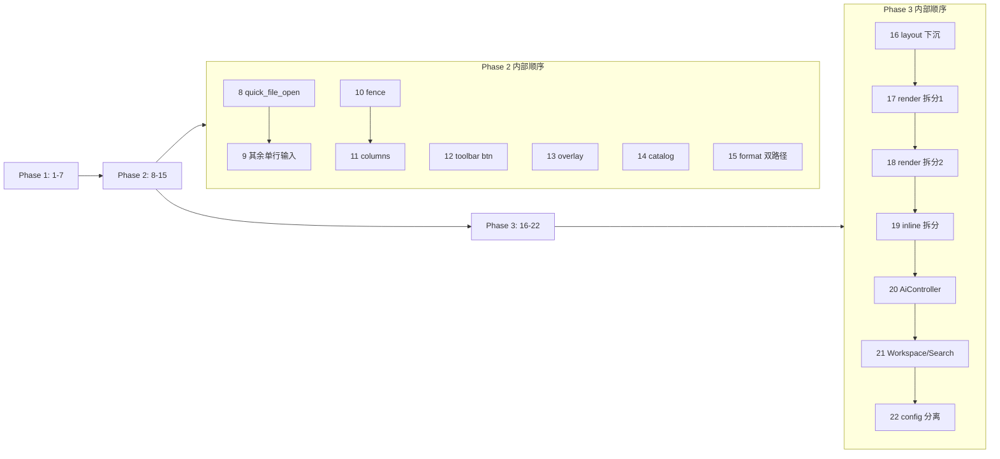

# 代码重构执行计划 — AI 分步提示词

本文档基于 [代码 Review 结论](development.zh-CN.md)，将 Velotype 重构工作拆分为 **Quick Wins → Medium → Large** 三阶段、共 **22 步**。每步可直接复制提示词块交给 AI Agent 执行。

[开发与构建](development.zh-CN.md) | [行内代码执行提示词示例](inline-code-run-implementation.zh-CN.md) | [执行队列使用说明](refactor-queue-usage.zh-CN.md)

---

## 执行原则

1. **严格按阶段顺序**：Phase 1 全部完成并验证后，再进入 Phase 2；Phase 2 中 fence/columns 统一（步骤 10–11）应早于 Editor 拆分（Phase 3）
2. **每步独立 PR**：一步一提交，便于 review 与回滚
3. **每步验收**：`cargo test`、`cargo build --release`，必要时 `./scripts/bench.sh` 对比基线
4. **不改行为**：重构步骤以「行为等价」为前提；若发现 bug，单独开 fix 提交
5. **提交消息**：简体中文，格式见 `.cursorrules`

---

## 阶段总览

| 阶段 | 步骤 | 主题 | 预估 |
| --- | --- | --- | --- |
| **Phase 1** Quick Wins | 1–7 | dead code、工具函数提取、测试外迁、i18n | 1–2 天 |
| **Phase 2** Medium | 8–15 | 单行输入 widget、工具栏组件、catalog 抽象、方言统一、overlay | 1–2 周 |
| **Phase 3** Large | 16–22 | mega-file 拆分、Editor 分解、配置 UI 分离 | 多周 |

---

## 总览块（每步开头附上）

以下块在每步提示词中重复出现，Agent 需全文阅读后再动手。

```markdown
# Velotype 重构任务

## 项目背景
Velotype（仓库目录 markmemo）是 Rust 2024 + GPUI 0.2 的块级 Markdown 编辑器。

核心模块：
- `src/editor/` — 窗口级 Editor 控制器（DocumentTree、undo、搜索、工作区、AI）
- `src/components/block/` — Block GPUI 实体（render.rs 5130 行、runtime/）
- `src/components/markdown/` — 纯 Markdown 解析/序列化（inline.rs 4162 行）
- `src/export/` — HTML/PDF 导出
- `src/theme/`、`src/i18n/` — 全局 ThemeManager / I18nManager
- `src/config/` — 偏好设置（preferences.rs 3550 行）
- `src/input/single_line.rs` — 单行输入共享逻辑

## 重构目标
降低重复代码、消除 components↔editor 循环依赖、拆分 mega-file、精简 Editor 上帝对象。

## 约束
- **行为等价**：不改变用户可见功能（除非步骤明确说明修复 bug）
- **最小 diff**：只改本步骤范围，不顺手改其他文件
- **匹配现有风格**：命名、错误处理、GPUI 模式与周边代码一致
- **不新增依赖**：除非步骤明确要求
- **测试**：`cargo test` 全绿；相关模块测试不可删
- **bench**：若改动 render/theme/i18n 热点，运行 `./scripts/bench.sh` 确认无显著回退
- **提交消息**：简体中文 `<type>(<scope>): <描述>`

## 当前步骤
见下方「步骤 N」标题与任务列表。完成后列出：修改文件、删除行数/新增行数、如何验证。
```

---

# Phase 1：Quick Wins（步骤 1–7）

---

## 步骤 1/22：删除 table root 别名 API

```markdown
# 步骤 1/22：删除 table root 别名 API

（附上「总览块」）

## 任务

1. 删除 `src/components/markdown/table.rs` 中三个仅做转发的别名函数：
   - `is_root_table_candidate_line` → 调用方改用 `is_table_candidate_line`
   - `collect_root_table_candidate_region` → 改用 `collect_table_candidate_region`
   - `parse_root_table_region` → 改用 `parse_table_region`

2. 全局搜索上述三个符号，更新所有 import 与调用（主要在 `src/editor/document.rs` 及 table 模块测试）

3. 更新 `table.rs` 内 `#[cfg(test)]` 中的引用

## 禁止
- 不修改 table 解析/序列化逻辑本身
- 不重构其他 markdown 模块

## 验收
- `cargo test` 通过
- `rg 'is_root_table|parse_root_table|collect_root_table'` 无生产代码引用
- 提交：`refactor(markdown): 移除 table root 别名 API`
```

---

## 步骤 2/22：清理 dead_code API

```markdown
# 步骤 2/22：清理 dead_code API

（附上「总览块」）

## 任务

1. 在 `src/components/block/runtime/mod.rs` 中，删除或移入 `#[cfg(test)]` 以下 `#[allow(dead_code)]` 方法（先 `rg` 确认无调用）：
   - `inline_style_at`
   - `inline_html_style_at`
   - `inline_link_at`
   - `inline_link_hit_at`
   - `inline_footnote_hit_at`
   - `inline_math_at`

2. 在 `src/components/block/runtime/projection.rs` 中同样处理 `pointer_target_offset`（若 `ExpandedInlineProjection` 测试需要则保留并去掉 dead_code 标注，改为 `pub(crate)` + 测试调用）

3. 删除 `src/components/actions.rs` 中未使用的 `pub fn init`（生产只用 `init_with_keybindings`）

4. 检查 `src/i18n/mod.rs` 中 `#[allow(dead_code)]` 的 `I18nManager::init`：若仅测试使用，改为 `#[cfg(test)]` 或让测试改用 `init_with_id`

## 禁止
- 不删除仍在用的 `#[allow(dead_code)]`（如 `inline.rs` 中尚未接入的语法扩展，除非确认无计划使用）

## 验收
- `cargo test` 通过
- `cargo build --release` 通过
- 列出删除的符号清单
- 提交：`refactor: 清理未使用的 dead_code API`
```

---

## 步骤 3/22：提取 HTML 转义模块

```markdown
# 步骤 3/22：提取 HTML 转义模块

（附上「总览块」）

## 任务

1. 新建 `src/components/markdown/escape.rs`：
   ```rust
   pub fn escape_html_text(value: &str) -> String
   pub fn escape_html_attr(value: &str) -> String
   ```
   实现与现有 `components/markdown/html.rs` 中逻辑一致（`& < > " '` 及属性转义规则不变）

2. 在 `src/components/markdown/mod.rs` 中 `mod escape;` 并 `pub use escape::{escape_html_text, escape_html_attr};`

3. 替换以下文件中的重复实现与 call site：
   - `src/components/markdown/html.rs` — 删除本地 `escape_html` / `escape_html_attr`，改用新模块
   - `src/components/markdown/inline.rs` — 删除私有 `escape_html_attr`，改用新模块
   - `src/export/html.rs` — 删除本地 `escape_html`（约 1258 行），改用 `escape_html_text`

4. 若 `export/html.rs` 仅需 text 转义，统一用 `escape_html_text`；属性场景用 `escape_html_attr`

## 禁止
- 不改变转义输出（字符对字符一致）
- 不修改 export HTML 结构

## 验收
- 为 `escape.rs` 添加单元测试（至少：`&<>"'`、属性内引号、空串）
- `cargo test` 通过
- `rg 'fn escape_html' src/` 仅出现在 `escape.rs`
- 提交：`refactor(markdown): 统一 HTML 转义到 escape 模块`
```

---

## 步骤 4/22：提取 GFM parser 选项

```markdown
# 步骤 4/22：提取 GFM parser 选项

（附上「总览块」）

## 任务

1. 在 `src/components/markdown/mod.rs`（或新建 `parser.rs`）添加：
   ```rust
   pub fn gfm_parser_options() -> pulldown_cmark::Options
   pub fn gfm_parser<'input>(markdown: &'input str) -> pulldown_cmark::Parser<'input>
   ```

2. 对比并合并以下两处现有选项，取**超集**（不可减少已启用的 extension）：
   - `src/export/html.rs` 的 `markdown_options()`
   - `src/components/block/render.rs` 的 `markdown_html_options()`

3. 上述两处改为调用 `gfm_parser_options()` / `gfm_parser()`

4. 删除两处重复的 private 函数

## 禁止
- 不修改 pulldown-cmark 版本
- 不改变 export 与 block 预览的 Markdown 渲染差异（合并选项后行为应一致或更完整）

## 验收
- `cargo test` 通过，尤其 `export/` 与 block render 相关测试
- 提交：`refactor(markdown): 统一 GFM parser 选项`
```

---

## 步骤 5/22：提取文本规范化工具

```markdown
# 步骤 5/22：提取文本规范化工具

（附上「总览块」）

## 任务

1. 新建 `src/components/markdown/text_norm.rs`（或 `src/input/text_norm.rs`，与 `single_line.rs` 同层 — 选一处并在 mod 中导出）

   提供：
   ```rust
   /// CRLF/CR → LF
   pub fn normalize_line_endings_lf(text: &str) -> String

   /// 粘贴文本压成单行（与 input/single_line.rs 中 sanitize_pasted_text 行为一致）
   pub fn flatten_paste_to_single_line(text: &str) -> String
   ```

2. 重构 `src/input/single_line.rs` 的 `sanitize_pasted_text` 为调用 `flatten_paste_to_single_line`（保持对外 API 不变）

3. 逐步替换以下文件中的内联换行/粘贴规范化逻辑（**行为保持一致**）：
   - `src/editor/mod.rs`
   - `src/components/block/input.rs`
   - `src/components/block/interactions.rs`
   - `src/components/block/runtime/code.rs`
   - `src/editor/workspace.rs`
   - `src/config/preferences.rs`
   - `src/editor/ai.rs` 的 `normalize_multiline_text`（若语义不同则保留独立函数，仅共用 LF 规范化部分）

4. 不要强行合并语义不同的函数；只提取**完全相同**的逻辑

## 验收
- 为 `text_norm.rs` 添加单元测试（CRLF、仅 CR、多行粘贴变单行）
- `cargo test` 通过
- 提交：`refactor: 提取文本换行与粘贴规范化工具`
```

---

## 步骤 6/22：外迁 document.rs 内联测试

```markdown
# 步骤 6/22：外迁 document.rs 内联测试

（附上「总览块」）

## 任务

1. 将 `src/editor/document.rs` 中 `#[cfg(test)] mod tests { ... }`（约 2140 行）移到独立文件：
   - 首选：`src/editor/document/tests.rs` + 在 `document.rs` 末尾 `#[cfg(test)] mod tests;`
   - 或：`src/editor/tests/document_import.rs`（若项目已有 `editor/tests.rs` 模式，选与现有风格一致的方式）

2. 测试代码**原样移动**，不改断言、不改辅助函数逻辑

3. 确保 private 函数可被测试访问：
   - 若测试需要 `parse_opening_fence` 等，在 `document.rs` 使用 `pub(crate)` 或通过 `#[cfg(test)]` 的 test-only re-export
   - 优先 `pub(crate)` + 允许测试模块 `use super::*`

4. 目标：`document.rs` 生产代码约 ≤ 1900 行

## 禁止
- 不修改测试断言
- 不修改 document 导入逻辑

## 验收
- `cargo test document` 或全量 `cargo test` 通过
- `wc -l src/editor/document.rs` 显著下降
- 提交：`refactor(editor): 外迁 document 模块内联测试`
```

---

## 步骤 7/22：修复 Mermaid 模板 i18n

```markdown
# 步骤 7/22：修复 Mermaid 模板 i18n

（附上「总览块」）

## 任务

1. 定位 `src/editor/format_toolbar.rs` 中 `MermaidTemplate::label()` 硬编码中文（约 49–57 行）

2. 在 `src/i18n/mod.rs`（及内置 locale 数据）添加对应 i18n 键，例如：
   - `mermaid_template_flowchart`
   - `mermaid_template_sequence`
   - …（与现有 enum 变体一一对应）

3. `MermaidTemplate::label()` 改为接收 `&I18nStrings` 或 `&I18nManager`，返回本地化字符串

4. 更新所有 call site 传入 i18n 上下文

5. 补英文与中文（及项目已有的其他 locale）

## 禁止
- 不改变 Mermaid 模板插入逻辑
- 不新增 SVG 图标

## 验收
- 切换语言后 Mermaid 菜单标签随之变化
- `cargo test` 通过
- 提交：`fix(i18n): Mermaid 模板标签改用语言包`
```

---

### Phase 1 完成检查清单

- [ ] 步骤 1–7 各有一个独立 commit
- [ ] `cargo test` && `cargo build --release` 全绿
- [ ] `rg 'is_root_table|fn escape_html' src/` 无残留重复
- [ ] `document.rs` 行数已下降

---

# Phase 2：Medium（步骤 8–15）

---

## 步骤 8/22：单行输入状态 struct 提取

```markdown
# 步骤 8/22：单行输入状态 struct 提取

（附上「总览块」）

## 背景
`document_search`、`workspace` 搜索、`quick_file_open`、`preferences` AI 输入等模块重复维护：
`query`、`marked_range`、`selected_range`、`selection_reversed`、`is_selecting`、`last_layout`、`last_bounds`

已有共享逻辑：`src/input/single_line.rs`

## 任务

1. 新建 `src/input/single_line_field.rs`：
   ```rust
   pub struct SingleLineFieldState {
       pub query: String,
       pub marked_range: Option<Range<usize>>,
       pub selected_range: Range<usize>,
       pub selection_reversed: bool,
       pub is_selecting: bool,
       pub last_layout: Option<ShapedLine>,
       pub last_bounds: Option<Bounds<Pixels>>,
   }
   impl SingleLineFieldState {
       pub fn new() -> Self
       pub fn clear(&mut self)
       // 委托 single_line.rs：move_caret、extend_selection、sanitize_paste 等
   }
   ```

2. **先迁移一个模块**作为模板：`src/editor/quick_file_open.rs`（范围最小）

3. 运行测试并手动验证 Quick File Open（Cmd+P 类功能）

4. 本步**只迁移 quick_file_open**，其他模块留到步骤 9

## 验收
- Quick File Open 行为与迁移前一致
- `cargo test` 通过
- 提交：`refactor(input): 提取 SingleLineFieldState 并迁移 quick_file_open`
```

---

## 步骤 9/22：单行输入迁移其余模块

```markdown
# 步骤 9/22：单行输入迁移其余模块

（附上「总览块」）

## 前置
步骤 8 已完成，`SingleLineFieldState` 已在 `quick_file_open` 验证

## 任务

1. 将以下模块迁移到 `SingleLineFieldState`（或基于它的 thin wrapper）：
   - `src/editor/document_search.rs`
   - `src/editor/workspace.rs`（workspace 搜索字段部分）
   - `src/config/toolbar_text_input.rs`
   - `src/config/preferences.rs`（`AiPreferenceInputState` — 若字段不完全一致，用 composition 而非强行合并）

2. 评估 `src/editor/single_line_input_element.rs` 是否可泛型化为：
   ```rust
   SingleLineFieldElement<T: SingleLineFieldTarget>
   ```
   若改动过大，本步只做 state 合并，element 留待后续

3. 删除迁移后模块内的重复字段与方法

## 验收
- 文档搜索、工作区搜索、偏好 AI 输入、工具栏文本输入均正常
- `cargo test` 通过
- 提交：`refactor(input): 单行输入状态迁移至 SingleLineFieldState`
```

---

## 步骤 10/22：统一 fence 解析模块

```markdown
# 步骤 10/22：统一 fence 解析模块

（附上「总览块」）

## 背景
fence 解析重复于：
- `src/editor/document.rs` — `parse_opening_fence` / `is_closing_fence` / `FenceInfo`
- `src/components/block/render.rs` — `opening_fence` / `is_closing_fence`（返回 `(char, usize)`）
- `src/export/html.rs` — 同名
- `src/editor/workspace.rs` — 同名
- `src/components/markdown/link.rs`、`image.rs` — `parse_reference_scan_opening_fence`

## 任务

1. 新建 `src/components/markdown/fence.rs`：
   ```rust
   pub struct FenceInfo { pub marker: char, pub run_len: usize, pub info: String }
   pub fn parse_opening_fence(line: &str) -> Option<FenceInfo>
   pub fn is_closing_fence(line: &str, opener: &FenceInfo) -> bool
   ```
   语义以 **`editor/document.rs` 当前行为为准**（含缩进规则、闭合 fence 长度匹配）

2. 编写单元测试：从 `document.rs` 测试中提取 fence 相关 case 到 `fence.rs` tests

3. 替换 `document.rs`、`block/render.rs`、`export/html.rs`、`workspace.rs` 中的本地实现

4. `link.rs` / `image.rs` 的 reference scan 若逻辑等价，改为调用 `parse_opening_fence`；若略有不同（仅 scan 用），保留 thin wrapper 并注明差异

5. 删除所有重复的 private fence 函数

## 禁止
- 不改变代码块/import/export 对 fence 的识别结果（测试为准）

## 验收
- `cargo test` 通过，尤其 document import、export html、workspace 相关测试
- `rg 'fn opening_fence|fn parse_opening_fence' src/` 仅 `fence.rs`（及 thin wrapper）
- 提交：`refactor(markdown): 统一 fence 解析到 fence 模块`
```

---

## 步骤 11/22：统一 columns 块解析模块

```markdown
# 步骤 11/22：统一 columns 块解析模块

（附上「总览块」）

## 前置
步骤 10 fence 模块已完成

## 背景
columns 语法重复于：
- `src/editor/document.rs`
- `src/components/block/render.rs`
- `src/export/html.rs` — `rewrite_columns_blocks`

## 任务

1. 新建 `src/components/markdown/columns.rs`：
   ```rust
   pub fn is_columns_block_start(line: &str) -> bool
   pub fn is_columns_block_end(line: &str) -> bool
   pub fn collect_columns_block_region(lines: &[impl AsRef<str>], start: usize) -> Option<usize>
   pub struct ColumnsBlock { ... }  // 按需
   pub fn parse_columns_block(lines: &[impl AsRef<str>], start: usize) -> Option<ColumnsBlock>
   ```

2. 以 `editor/document.rs` import 行为为 golden，编写对比测试

3. 三处调用方改为使用本模块；`export/html.rs` 的 HTML 生成仍留 export 层，但**区域边界检测**必须用共享 parser

4. 从 `block/render.rs` 删除重复的 `is_columns_block_*`、`collect_columns_block_region`、`parse_columns_markdown` 中与 parser 重叠部分

## 验收
- columns 相关现有测试全过
- import / 块预览 / export HTML 对同一 columns 源码行为一致（可加 snapshot 测试）
- 提交：`refactor(markdown): 统一 columns 块解析`
```

---

## 步骤 12/22：工具栏图标按钮组件

```markdown
# 步骤 12/22：工具栏图标按钮组件

（附上「总览块」）

## 任务

1. 新建 `src/components/toolbar_button.rs`（或 `src/editor/toolbar_button.rs`）：
   ```rust
   pub fn toolbar_icon_button(
       theme: &Theme,
       icon_path: &str,
       active: bool,
       disabled: bool,
       tooltip: impl Into<SharedString>,
   ) -> impl IntoElement
   ```
   样式以 `src/editor/format_toolbar.rs` 中 `render_history_toolbar_button` 为基准

2. 先重构 `format_toolbar.rs` 内 2–3 个按钮验证 API

3. 再重构：
   - `src/editor/document_search.rs`（搜索栏按钮，约 421–506 行）
   - `src/editor/ai.rs` — `render_ai_selection_toolbar_button`

4. 不改变按钮尺寸、hover、active 颜色与 tooltip 行为

## 验收
- 格式工具栏、文档搜索、AI 浮动工具栏视觉与交互与重构前一致
- `cargo test` 通过
- 提交：`refactor(ui): 提取 toolbar_icon_button 组件`
```

---

## 步骤 13/22：Overlay 栈简化

```markdown
# 步骤 13/22：Overlay 栈简化

（附上「总览块」）

## 背景
`src/editor/render.rs` 约 1824–1898 行：10+ 层 `if let Some(...) = self.render_*_overlay` 嵌套

## 任务

1. 新建 `src/editor/overlays.rs`：
   ```rust
   pub enum EditorOverlayKind { ContextMenu, AiToolbar, CodeLanguageMenu, ... }
   impl Editor {
       fn collect_active_overlays(&self, ...) -> Vec<EditorOverlayKind>
       fn render_overlay(&self, kind: EditorOverlayKind, ...) -> Option<AnyElement>
       fn render_overlay_stack(&self, base: ..., ...) -> impl IntoElement
   }
   ```

2. 将各 `render_*_overlay` 方法**原样搬入** `overlays.rs` 或保持 render.rs 中 impl 块但由 `render_overlay_stack` 统一调度

3. 主 `render` 方法末尾改为一行 `render_overlay_stack` 调用

4. 保留 overlay 优先级顺序（与现有 if-else 链一致）

## 禁止
- 不改变 overlay 叠放顺序与互斥逻辑（尤其 info_dialog / code_run_dialog / quick_file_open 的 else-if 链）

## 验收
- 手动验证：右键菜单、AI 工具栏、代码语言菜单、Mermaid 菜单、quick file open、未保存对话框等均可正常显示
- `cargo test` 通过
- 提交：`refactor(editor): 提取 overlay 栈渲染`
```

---

## 步骤 14/22：Theme/I18n catalog 抽象（第一阶段）

```markdown
# 步骤 14/22：Theme/I18n catalog 抽象（第一阶段）

（附上「总览块」）

## 任务

本步采用**轻量抽象**，不用过程宏，避免一次改动过大。

1. 新建 `src/catalog.rs`（或 `src/config/catalog.rs`）：
   ```rust
   pub trait ConfigCatalog {
       type Item: Clone + Send + Sync + 'static;
       fn builtin_ids() -> &'static [&'static str];
       fn load_from_file(path: &Path) -> Result<Self::Item>;
       fn save_to_file(item: &Self::Item, path: &Path) -> Result<()>;
   }
   ```

2. 提取 `ThemeManager` 与 `I18nManager` 中**完全相同**的样板方法到 free functions 或 small helper：
   - 从目录扫描 `*.json` / `*.jsonc`
   - import 文件到 config dir
   - 按 id 查找、fallback 逻辑

3. 两个 manager 改为调用 helper；**不合并两个 manager 为一个泛型 struct**（留 Phase 3 或更后）

4. 运行 `./scripts/bench.sh theme_arc i18n_arc` 确认无回退

## 验收
- 主题/语言切换、导入 custom theme/language 正常
- bench 无显著回退
- 提交：`refactor: 提取 Theme/I18n catalog 公共加载逻辑`
```

---

## 步骤 15/22：统一工具栏 format 双路径

```markdown
# 步骤 15/22：统一工具栏 format 双路径

（附上「总览块」）

## 背景
- 源码模式：`components/markdown/source_format.rs`
- 块模式：`components/block/format_toolbar.rs`
- 路由：`editor/format_toolbar.rs`

## 任务

1. 在 `source_format.rs` 中确保以下函数对**纯文本 + Range** 操作完备：
   - `apply_link_format`、`apply_image_format`
   - bold/italic/strike 等已有 action

2. 重构 `block/format_toolbar.rs` 的 `insert_link_markdown`、`insert_image_markdown`：
   - 从 block 提取选区文本 → 调用 `source_format` → 写回 `InlineTextTree`

3. `editor/format_toolbar.rs` 保持路由职责，不膨胀

4. 删除 block/format_toolbar 中与 source_format 重复的 URL 常量（提到 `source_format` 或 `markdown/link.rs` 公共 const）

## 验收
- 渲染模式下工具栏插入链接/图片与重构前一致
- 源码模式不受影响
- `cargo test` 通过
- 提交：`refactor(toolbar): 块模式链接图片插入复用 source_format`
```

---

### Phase 2 完成检查清单

- [ ] 步骤 8–15 各 commit
- [ ] fence/columns 仅存在于 `components/markdown/`
- [ ] `./scripts/bench.sh theme_arc i18n_arc render_loop` 无显著回退
- [ ] 主要 overlay 与搜索 UI 手动冒烟通过

---

# Phase 3：Large（步骤 16–22）

---

## 步骤 16/22：布局常量下沉，打破循环依赖

```markdown
# 步骤 16/22：布局常量下沉，打破循环依赖

（附上「总览块」）

## 背景
`components/block/render.rs` 依赖 `Editor::centered_column_width`（`editor/window_state.rs`），形成 components→editor 循环依赖。

## 任务

1. 新建 `src/layout/document_column.rs`（或放入 `src/theme/layout.rs`）：
   ```rust
   pub fn centered_column_ratio(theme: &Theme) -> f32
   pub fn centered_column_width(viewport_width: Pixels, theme: &Theme) -> Pixels
   ```
   逻辑从 `editor/window_state.rs` **原样搬移**

2. `Editor` 改为调用 layout 模块；删除 `Editor` 上的同名方法或改为 delegate

3. `block/render.rs` 改为 `use crate::layout::document_column::*`，**不再 use Editor**

4. `rg 'use crate::editor::Editor' src/components/` 应为 0（`components/mod.rs` 的 re-export 除外）

## 验收
- 列宽与重构前一致（不同窗口宽度下目视检查）
- `cargo test` 通过
- 提交：`refactor(layout): 下沉文档列宽计算，消除 block→editor 依赖`
```

---

## 步骤 17/22：拆分 block/render.rs（第一阶段）

```markdown
# 步骤 17/22：拆分 block/render.rs（第一阶段）

（附上「总览块」）

## 任务

1. 创建目录 `src/components/block/render/`：
   ```
   mod.rs          — Render impl 主入口 + dispatch
   columns.rs      — columns 预览渲染（parser 用 markdown/columns.rs）
   code.rs         — 代码块渲染
   table.rs        — 表格渲染
   image.rs        — 图片/figure 渲染
   math.rs         — 行内/块级公式
   mermaid.rs      — mermaid 块
   html_block.rs   — 原生 HTML 块预览
   ```

2. **本步只迁移 2–3 个 block kind**（建议 `code.rs` + `table.rs` + `mermaid.rs`），降低风险

3. `render/mod.rs` 保留 `impl Render for Block` 的 match 分发，调用子模块 `pub fn render_*`

4. 删除 `render.rs` 原文件中已迁出代码；原文件改为 `mod render;` 或 rename

5. 跑 `./scripts/bench.sh render_loop`

## 禁止
- 不修改渲染输出
- 一步迁完所有 kind

## 验收
- 代码块、表格、mermaid 块显示与交互正常
- bench render_loop 无显著回退
- 提交：`refactor(block): 拆分 render 模块（code/table/mermaid）`
```

---

## 步骤 18/22：拆分 block/render.rs（第二阶段）

```markdown
# 步骤 18/22：拆分 block/render.rs（第二阶段）

（附上「总览块」）

## 前置
步骤 17 已完成部分 kind 迁移

## 任务

1. 继续迁移剩余 block kind 到 `src/components/block/render/`：
   - paragraph / heading / list / quote / callout
   - columns、html_block、image、math
   - 行内代码 run 按钮等 overlay 元素（可 `inline_code.rs`）

2. 目标：原 `render.rs` 单文件 ≤ 500 行（仅 dispatch + 共享 helper）

3. 跑全量 bench + 手动打开 `assets/showcase/` 下 demo 文档

## 验收
- showcase 文档渲染正常
- `cargo test` + `./scripts/bench.sh render_loop` 通过
- 提交：`refactor(block): 完成 render 模块按 block kind 拆分`
```

---

## 步骤 19/22：拆分 markdown/inline.rs

```markdown
# 步骤 19/22：拆分 markdown/inline.rs

（附上「总览块」）

## 任务

1. 分析 `src/components/markdown/inline.rs`（4162 行）结构，按 concern 拆分，建议：
   ```
   inline/
   mod.rs              — InlineTextTree 核心 type + re-export
   fragment.rs         — InlineFragment 枚举与基础操作
   normalize.rs        — normalize_inline_syntax*
   style.rs            — InlineStyle、style_at
   link_image.rs       — 链接/图片 span
   math.rs             — 行内公式
   html.rs             — 行内 HTML
   serialize.rs        — 序列化回 Markdown
   ```

2. 保持 `components/markdown/mod.rs` 的 public API 不变（`pub use inline::*`）

3. 测试随模块移动，不改断言

4. 跑 `./scripts/bench.sh build_text_runs shared_display_text`

## 验收
- 无 public API breaking（crate 内 call site 可通过 re-export 不变）
- inline 相关测试全过
- 提交：`refactor(markdown): 拆分 inline 模块`
```

---

## 步骤 20/22：Editor 子控制器拆分（第一阶段）

```markdown
# 步骤 20/22：Editor 子控制器拆分（第一阶段）

（附上「总览块」）

## 任务

1. 新建 `src/editor/controllers/ai.rs`：
   ```rust
   pub struct AiController { /* 从 Editor 移出的 ai 相关字段 */ }
   impl AiController { /* 从 editor/ai.rs 迁出的状态与方法 */ }
   ```

2. `Editor` 改为 `ai: AiController` 字段组合；`editor/ai.rs` 保留 impl 块或 merge 进 controller

3. 对外 `Editor` 方法通过 `self.ai.` 委托，**不改变 pub API**

4. 本步**只拆 AI**；workspace/search/overlay 留步骤 21

5. 目标：`Editor` 字段减少 ~15 个

## 验收
- AI 补全、浮动工具栏、preview 正常
- `cargo test` 通过
- 提交：`refactor(editor): 提取 AiController`
```

---

## 步骤 21/22：Editor 子控制器拆分（第二阶段）

```markdown
# 步骤 21/22：Editor 子控制器拆分（第二阶段）

（附上「总览块」）

## 前置
步骤 20 AiController 已完成

## 任务

1. 提取 `WorkspaceController`（`workspace.rs` + `workspace_file_menu.rs` 状态）
2. 提取 `SearchController`（`document_search.rs` + workspace 搜索字段）
3. `Editor` 保留核心：document tree、view_mode、file_path、undo、scroll、view render 调度

4. 可选：提取 `CodeRunController`（`code_run.rs` 状态）

5. 目标：`editor/mod.rs` 中 `Editor` struct 字段 ≤ 35

## 验收
- 工作区、文件树、文档搜索、跨文件搜索正常
- undo/redo、保存、关闭流程正常
- 提交：`refactor(editor): 提取 Workspace 与 Search 控制器`
```

---

## 步骤 22/22：config 存储与 UI 分离

```markdown
# 步骤 22/22：config 存储与 UI 分离

（附上「总览块」）

## 背景
`src/config/preferences.rs`（3550 行）混合 TOML 读写与完整 GPUI 偏好窗口。

## 任务

1. 新建 `src/config/store.rs`（或 `preferences/store.rs`）：
   - 配置 struct 定义（从 preferences 抽出）
   - load/save TOML
   - 默认值、merge 逻辑
   - **无 GPUI 依赖**

2. 新建 `src/config/ui/preferences/`（或 `preferences/window.rs`）：
   - GPUI 窗口、表单控件
   - 仅调用 store API

3. `preferences.rs` 瘦身为 mod 入口 + re-export

4. 为 `store.rs` 添加不依赖 GPUI 的单元测试

5. 目标：`store.rs` 可独立 `cargo test -p` 逻辑测试（若 workspace 结构允许）

## 禁止
- 不改变偏好设置项与持久化格式
- 不 redesig UI

## 验收
- 偏好窗口所有选项可保存/加载
- `allow_code_execution` 等现有选项正常
- `cargo test` 通过
- 提交：`refactor(config): 分离偏好设置存储与 UI`
```

---

### Phase 3 完成检查清单

- [ ] `block/render/` 与 `markdown/inline/` 已拆分
- [ ] `Editor` 字段 ≤ 35，`components` 不依赖 `editor`
- [ ] `config/store.rs` 无 GPUI import
- [ ] 全量 `cargo test`、`cargo build --release`、`./scripts/bench.sh` 通过
- [ ] 手动冒烟：编辑、保存、导出 HTML/PDF、工作区、主题/语言切换

---

## 附录 A：每步通用验收命令

```bash
source "$HOME/.cargo/env"
cd /path/to/markmemo

# 编译检查
cargo check

# 全量测试
cargo test

# Release 构建
cargo build --release

# 热点 bench（按需）
./scripts/bench.sh theme_arc i18n_arc render_loop build_text_runs
```

---

## 附录 B：依赖关系图



---

## 附录 C：给 Agent 的简短启动模板

复制以下模板，将 `{N}` 和 `{步骤标题}` 替换为实际值：

```markdown
请阅读 `docs/refactor-execution-plan.zh-CN.md` 中的 **步骤 {N}/22：{步骤标题}** 及文首「总览块」。

要求：
1. 只做该步骤范围内的改动
2. 行为等价，不顺手改其他模块
3. 完成后运行 `cargo test` 和 `cargo build --release`
4. 用中文总结：改了哪些文件、如何验证、建议的 commit message

开始执行。
```

---

## 附录 D：可选后续（超出本计划）

| 项 | 说明 |
| --- | --- |
| LaTeX/Mermaid 统一 `cached_svg` | 在步骤 11 后独立小 PR |
| `editor/events.rs` 按事件类型拆分 | 在步骤 21 后执行 |
| `main.rs` 图标注册代码生成 | 独立 tooling PR，非必须 |
| workspace 拆分为独立 crate | 长期目标，需单独设计 |

---

*文档版本：与 2026-06 代码 Review 对齐。执行过程中若发现步骤顺序需调整，请在本文件末尾追加「变更记录」。*
