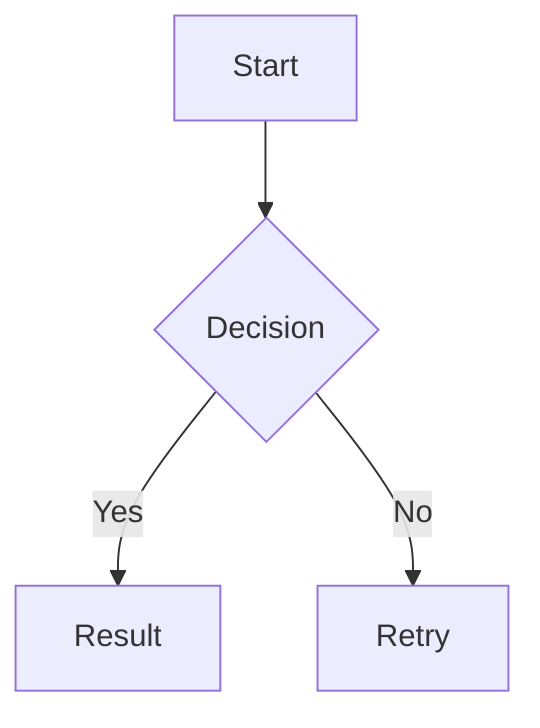
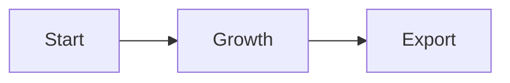

<!--
Comprehensive Markdown rendering test suite
Target: CommonMark + widely used extensions (GFM-style and common editor extensions)
Purpose: stress test block parsing, inline parsing, nesting, boundary conditions, and mixed-mode rendering.
-->

# Markdown Rendering Test Suite

> This file intentionally mixes many Markdown patterns in one document.
> It is designed to test parser correctness, incremental re-rendering, cursor behavior, selection mapping, and source/render mode switching.

---

## 1. Paragraphs, line breaks, blank lines

Simple paragraph.

Paragraph with two spaces at end to force a hard line break.  
Next line after hard break.

Paragraph with a soft line break
next line should stay in the same paragraph unless renderer collapses it visually.

Paragraph separated by a blank line.

### Very short paragraph after heading

---

## 2. Headings

# H1 Heading

## H2 Heading

### H3 Heading

#### H4 Heading

##### H5 Heading

###### H6 Heading

# Setext heading level 1

## Setext heading level 2

---

## 3. Emphasis, strong, nested emphasis, and edge cases

*italic*

*italic*

**bold**

**bold**

***bold italic***

***bold italic***

*italic bold*

This is **bold with *italic inside* and more bold**.

This is *italic with *<strong><em>bold inside</em></strong>* and more italic*.

Underscore inside words should not always trigger emphasis: foo*bar*baz.

Asterisks adjacent to punctuation: this*should*be tested.

Nested emphasis with escaping: \*not italic\* and \_not italic\_.

---

## 4. Inline code and code spans

`inline code`

``inline `code` with backticks``

```inline ``code`` with longer delimiter```

A code span can contain punctuation: `if (a < b && c > d) { return x; }`

A code span can contain emphasis markers literally: `*not emphasized*`

A code span can contain links literally: `[text](https://example.com)`

Code span with leading and trailing spaces preserved by delimiter rules: `  spaced  `

Code span across line breaks:
`line 1
line 2`

Backticks in normal text: `` ` `` and ``` `` ``` and ```` ``` ````

---

## 5. Links, images, autolinks, reference links

[inline link](https://example.com)

[inline link with title](https://example.com "Example Title")

[link with parentheses](https://example.com/a_(b)c)

[reference link][ref-link]

[collapsed reference][collapsed reference]

[shortcut reference][shortcut reference]


![reference image][ref-image]

<https://example.com>

<mailto:test@example.com>

Autolink-like text should stay literal when escaped: \\<https://example.com>

[ref-link]: https://example.com

[collapsed reference]: https://example.org

[shortcut reference]: https://example.net

[ref-image]: https://example.com/image.png "Image Title"

---

## 6. Lists

- Item 1
- Item 2
- Item 3

1. Ordered item 1
2. Ordered item 2
3. Ordered item 3

1. Ordered with explicit start

1. Another ordered item
2. Next item

- Mixed list item
  - Nested bullet
  - Nested bullet with paragraph

- Item with paragraph

  Continued paragraph inside list item.

- Item with code block
  ```
  let x = 1;
  let y = 2;
  ```

1. Item with nested quote
  > quoted text
  > 
  > quoted paragraph two

- Item with task list style syntax
  - [ ] unchecked task
  - [x] checked task

- Item with emphasis and link: **bold** and [link](https://example.com)

---

## 7. Blockquotes

> Blockquote paragraph one.
> 
> Blockquote paragraph two with **bold** and `code`.

> Nested quote level 1
> > Nested quote level 2
> > > Nested quote level 3

> Quote with list:
> - item 1
> - item 2
>   - nested item

> Quote with code block:
> 
> ```
> fn main() {
>     println!("hello");
> }
> ```

---

## 8. Code blocks

Indented code block:

```
fn main() {
    println!("indented code block");
}

```

Fenced code block with language:

```rust
fn main() {
    println!("fenced code block");
}
```

Fenced code block with info string and meta:



Fence containing backticks inside should still work:

```text
This line contains `backticks` literally.
```

Longer fence to contain triple backticks:

~~~markdown
```
nested fence content
```
~~~

Additional language coverage:

```bash
echo "hello"
if [ -f ./file.txt ]; then
  echo ok
fi
```

```c
int add(int a, int b) {
    return a + b;
}
```

```cpp
class Box {
public:
    int value = 1;
};
```

```csharp
class App {
    static void Main() {
        var value = 42;
    }
}
```

```css
.card {
  color: #fff;
  display: grid;
}
```

```go
package main

func main() {
    println("hello")
}
```

```html
<div class="card">
  <span>Hello</span>
</div>
```

```java
class App {
    int add(int a, int b) {
        return a + b;
    }
}
```

```php
<?php
echo "hello";
$value = 42;
?>
```

```python
def double(x: int) -> int:
    return x * 2
```

```ruby
def hello(name)
  puts "Hello, #{name}"
end
```

```yaml
service:
  name: velotype
  enabled: true
```

```toml
[package]
name = "velotype"
edition = "2024"
```

```jsx
const App = () => <button className="primary">OK</button>;
```

```tsx
type User = { id: number };
const App = (): JSX.Element => <div data-id={1}>TSX</div>;
```

---

## 9. Horizontal rules

---

---

---

Paragraph above and below horizontal rule should remain distinct.

## Text

Another paragraph-like setext case.

---

## 10. HTML blocks and inline HTML

<div class="note">
  <p>HTML block with <strong>inline HTML</strong>.</p>
</div>

<p>Inline HTML paragraph with <em>emphasis inside HTML</em>.</p>

Custom element test:

<details>
<summary>Expandable summary</summary>

Hidden content with `inline code` and **bold**.

</details>

Raw HTML comment should not render visibly:

<!-- This is a comment -->

---

## 11. Escapes and entities

\* escaped asterisk \*

\_ escaped underscore \_

\` escaped backtick \`

[ escaped bracket ]

\\# escaped heading marker

\\> escaped blockquote marker

&copy; &amp; &lt; &gt; &quot;

AT&T should remain readable.

---

## 12. Tables

| Left | Center | Right |
| --- | :---: | ---: |
| a | b | c |
| **bold** | `code` | [link](https://example.com) |
| multiline<br>html | image  | text |

| Pipe in cell | Escaped pipe |
| --- | --- |
| A \| B | literal pipe |

Table with inline formatting inside cells:

| Syntax | Example |
| --- | --- |
| Emphasis | *italic* |
| Strong | **bold** |
| Code | `code` |
| Link | [text](https://example.com) |

---

## 13. Task lists

- [ ] Unchecked task
- [x] Checked task
- [ ] Task with **bold** and `code`
- [x] Task with [link](https://example.com)
- [ ] Task with nested list
  - [ ] nested unchecked
  - [x] nested checked

---

## 14. Footnotes

Here is a footnote reference.[^1]

Here is another footnote reference.[^longnote]

A footnote can appear after multiple paragraphs, lists, and code blocks.

[^1]: Footnote text.

[^longnote]: Footnote text with **bold**, `code`, and a nested list:

    - item 1
    - item 2

    Second paragraph in the footnote.

---

## 15. Strikethrough

~~strikethrough~~

This is ~~deleted text with ~~**~~bold~~**~~ and `code`~~.

Multiple tildes: not necessarily strike in every renderer

---

## 16. Definition list style (extension)

Term 1
: Definition 1

Term 2
: Definition 2 with **bold** and `code`.

Another term
: First definition paragraph.

: Second definition paragraph.

---

## 17. Superscript and subscript style (extension)

x^2^

H\~2\~O

Mixed: E = mc^2^ and H\~2\~O in the same paragraph.

---

## 18. Emoji and mentions style (extension)

:smile: :rocket: :warning:

@user-name

#123

---

## 19. Math style (extension)

Inline math: $E = mc^2$

Display math:

$$
\int_0^1 x^2 \, dx = \frac{1}{3}
$$

Math with Markdown-like content inside:
$ \\text{Use *literal* markdown?} $

---

## 20. Admonition / callout style (extension)

> [!NOTE]
> This is a note callout.
> 
> It can include **bold**, `code`, and a list:
> - item 1
> - item 2

> [!WARNING]
> This is a warning callout with a nested blockquote:
> 
> > inner quote
> 
> And a fenced code block:
> 
> ```js
> console.log("warn");
> ```

---

## 21. Mixed composition stress tests

### 21.1 Inline nesting in paragraphs

Paragraph with **bold, *italic, `code`, and a ***[***link***](https://example.com)*** inside italic*** outside.

Paragraph with `code containing [brackets] and *stars* and _underscores_` plus text.

Paragraph with a link containing emphasis text [**bold label**](https://example.com).

Paragraph with an image and link:  and [another link](https://example.org).

### 21.2 Block nesting

> Blockquote
> 
> 1. Ordered item
>   - Nested bullet
>   - Nested bullet with **bold**
> 
> 1. Second ordered item
>   ```python
>   print("inside blockquote and list")
>   ```
> 
>   Paragraph after code block.

### 21.3 List nesting with blockquote and table

- List item
  > Quote inside list item
  >   
  > | A | B |
  > | --- | --- |
  > | 1 | 2 |

- List item with HTML block
  <div>
    <p>HTML inside list item</p>
  </div>

### 21.4 Link reference and emphasis collision

This [reference][mix-ref] should render correctly even with **bold** around it.

This [shortcut][shortcut] reference should also work.

[mix-ref]: https://example.com/mix

[shortcut]: https://example.com/shortcut

### 21.5 Fence + inline code + emphasis collision

```md
This fenced block contains `inline code`, **bold**, and [links](https://example.com).
```

Outside the fence: `inline code` and **bold** and [links](https://example.com).

---

## 22. Very tricky edge cases

Empty paragraph after blank line.


A paragraph after multiple blank lines.

A line ending with backslash for hard break.\\
Next line.

A list item that starts with punctuation:

- (Optional) item text
- [ ] task syntax after punctuation

A blockquote with blank lines:

> First paragraph in quote.
> 
> Second paragraph in quote.

A setext heading followed by a paragraph

## Heading text

Paragraph after setext heading.

A fenced code block immediately after a paragraph:

```json
{"key":"value"}
```

A blockquote immediately after a paragraph:

> quoted immediately after paragraph

A thematic break immediately after a paragraph:

## Paragraph

A table immediately after a paragraph:

| A | B |
| --- | --- |
| 1 | 2 |

---

## 23. Raw source diagnostics helpers

<!--
Use this section to inspect whether your editor preserves source ranges and syntax highlighting state.
You may choose to keep or remove it.
-->

Source range probe: `alpha` `beta` `gamma`

Delimiter density probe: `a` `b` `c`

Whitespace probe: `  left  ` and `right` and ` center  `.

Mixed punctuation probe: ([*link*](https://example.com)) and 

---

## 24. Columns block

Minimal columns syntax:

::: columns
--- column
Left column paragraph with **bold** text and a list:

- Alpha
- Beta

--- column
Right column paragraph with `inline code` and a quote:

> Quote inside the right column.
:::

Columns mixed with table and chart syntax:

::: columns
--- column width=40%
### Metrics Table

| Metric | Value |
| --- | --- |
| PV | 1200 |
| UV | 300 |

--- column width=60%
### Trend Chart


:::

Columns containing a fenced code block with marker-like text:

::: columns
--- column
```markdown
--- column
::: columns
These marker-like lines are code, not columns syntax.
```

--- column
The second column should still render normally.
:::

---

## 25. Final mixed mega-block

> [!IMPORTANT]
> Final mixed block that combines:
> 
> - **bold**
> - *italic*
> - `inline code`
> - [link](https://example.com)
> - 
> - ~~strike~~
> 
> And a table:
> 
> | k | v |
> | --- | --- |
> | a | 1 |
> | b | 2 |
> 
> And a fenced code block:
> 
> ```ts
> export const answer = 42;
> ```
> 
> And a footnote reference.[^final]
> 
> [^final]: Final footnote text with nested list:
> 
>     - one
>     - two


---

End of test file.
